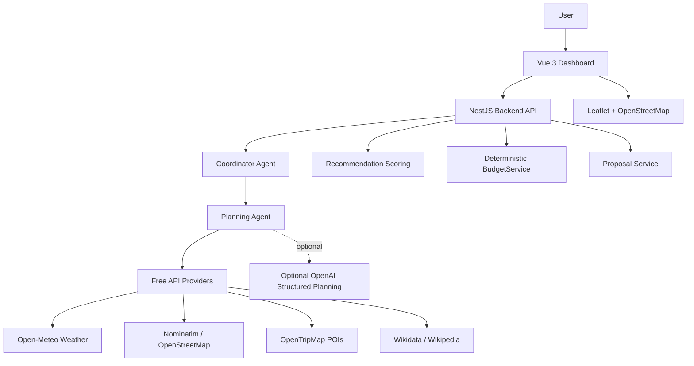

# Reiseplanungs-Agent

Ein intelligenter Reiseplanungs-Agent als dashboard-zentrierte Web-App. Der Prototyp zeigt, wie Reisen strukturiert geplant, begruendet, budgetiert und bei Aenderungen wie schlechtem Wetter kontrolliert umgeplant werden koennen.

MVP 1 ist als interaktive Demo abgeschlossen. Die naechste Projektstrategie setzt auf kostenfreie APIs und regelbasierte Agentenlogik; OpenAI Structured Planning ist technisch vorbereitet, aber fuer MVP 2 kein Pflichtbestandteil.

## Features

- strukturierte Reiseplanung ueber Dashboard
- Demo-Reise Berlin
- freie Reiseanfrage ueber `POST /api/trips/plan`
- Tagesplaene mit Zeitfenstern
- Budgetplanung mit deterministischer Berechnung
- Restaurants, Museen, Sehenswuerdigkeiten und Aktivitaeten
- Agent Insights fuer nachvollziehbare Agentenschritte
- Chat mit Fallback-Antworten und optionaler OpenAI-Unterstuetzung
- Replanning bei Wetteraenderungen
- Simulation von Regen an Tag 2
- Proposal Flow mit Accept/Reject
- schematische Routenuebersicht
- vorbereitete optionale OpenAI Structured Planning Experimente

## MVP-Struktur

| MVP | Name | Status | Ziel |
| --- | --- | --- | --- |
| MVP 1 | Foundation & Interactive Demo | abgeschlossen | Stabile Berlin-Demo mit Dashboard, Budget, Chat, Replanning und Proposal Flow |
| MVP 2 | Free API Travel Planning | geplant / in Arbeit | Echte Reiseplanung mit kostenfreien Providern und regelbasierter Agentenlogik |
| MVP 3 | Real World Polish | geplant | Persistenz, bessere Karte, Exporte, Praesentationspolish und produktnaehere Features |

## Architekturuebersicht

```text
Vue 3 Dashboard
->
NestJS Backend
->
Coordinator Agent
->
Planning Agent
->
Free API Providers + regelbasierte Services
->
Recommendation Scoring + BudgetService + Proposal Flow
```



Das Backend bleibt die Source of Truth fuer Plan, Budget, Proposals und Bestaetigungsstatus. Das Frontend rendert strukturierte Daten und loest Nutzeraktionen aus, trifft aber keine finalen Business-Entscheidungen.

## Agentenarchitektur

| Agent | Verantwortung |
| --- | --- |
| Coordinator Agent | Routet Nutzeranfragen, koordiniert Spezialagenten, fuehrt Ergebnisse zusammen und schuetzt kritische Aenderungen durch Nutzerbestaetigung. |
| Planning Agent | Erstellt Tagesstruktur und orchestriert die Planerzeugung. Fuer MVP 2 soll der Standardpfad ueber Free APIs und regelbasierte Logik laufen. |
| Recommendation Agent | Bewertet Restaurants, Museen, Sehenswuerdigkeiten und Aktivitaeten anhand von Interessen, Wetter, Budget und Lage. |
| Budget Agent / BudgetService | Prueft und berechnet Budgetdaten deterministisch. Finale Budgetwerte kommen nicht vom LLM und nicht aus dem Frontend. |
| Replanning Agent | Reagiert auf Wetteraenderungen, erkennt betroffene Outdoor-Aktivitaeten und erzeugt Aenderungsvorschlaege. |
| Checklist Agent | Erstellt Packliste, Dokumentenliste und einfache Reisevorbereitungen. |

## OpenAI Einordnung

OpenAI ist technisch im Backend vorbereitet:

- `OpenAiService` kapselt OpenAI Responses API Aufrufe und bietet Fallbacks.
- `OpenAiPlanningService` kann strukturierte Planvorschlaege anfragen.
- `StructuredPlanNormalizer` validiert und normalisiert optionale OpenAI-Ausgaben.
- `TripPlanFactory` bleibt Demo-/technische Mock-Planerzeugung und ist nicht der Standardpfad fuer eigene Reisen.

Fuer die kostenfreie MVP-2-Zielarchitektur ist OpenAI kein Pflichtbestandteil. OpenAI bleibt optional fuer Chat, Begruendungen, Textveredelung und experimentelle AI Structured Planning Pfade. Der Standardpfad fuer echte Reiseplanung soll ueber kostenfreie Provider und regelbasierte Agentenlogik laufen.

## Free API Provider

| Bereich | Provider | Rolle |
| --- | --- | --- |
| Wetter | Open-Meteo | Wetterdaten fuer Reiseplanung und Replanning |
| Geocoding | Nominatim / OpenStreetMap | Zielort, Koordinaten und Ortsaufloesung |
| POIs | OpenTripMap | Sehenswuerdigkeiten, Museen, Aktivitaeten und Orte |
| Wissen | Wikidata / Wikipedia | Ergaenzende Ortsinformationen, Beschreibungen und Plausibilisierung |
| Karte | Leaflet + OpenStreetMap | Kartenansicht im Frontend |
| Routing | OSRM | Optional fuer Routen; Demo Server nur fuer nicht-produktive Tests, spaeter selbst hostbar |

Provider sollen ueber klare Interfaces angebunden werden, damit Mock-Daten, Free APIs und spaetere produktive Provider austauschbar bleiben.
Die Standardplanung nutzt zuerst Wikidata, ergaenzt bei Bedarf Wikipedia GeoSearch und verwendet OpenTripMap nur optional, wenn lokal `OPENTRIPMAP_API_KEY` gesetzt ist. `TripPlanFactory` bleibt fuer die Berlin-Demo und technische Fallbacks im Repository, ist aber nicht mehr der Aktivitaetsfallback fuer eigene Reiseplanung.

## Tech Stack

| Bereich | Technologie |
| --- | --- |
| Frontend | Vue 3 |
| State Management | Pinia |
| Routing | Vue Router |
| Backend | NestJS |
| Sprache | TypeScript |
| Monorepo | npm Workspaces |
| Build Tool | Vite |
| Datenhaltung MVP 1 | In-Memory |
| Planung MVP 2 | Free APIs + regelbasierte Agentenlogik |
| Optionales LLM | OpenAI Responses API |
| Datenbank MVP 3 | PostgreSQL |
| Karte | Leaflet + OpenStreetMap |

## Projektstruktur

```text
travel-agent/
|-- package.json
|-- README.md
|-- spec_travel_agent.md
|-- frontend/
|   |-- index.html
|   |-- vite.config.ts
|   `-- src/
|       |-- components/
|       |-- views/
|       |-- stores/
|       |-- services/
|       |-- router/
|       `-- assets/
|-- backend/
|   `-- src/
|       |-- modules/
|       |   |-- travel/
|       |   |-- agent/
|       |   |-- openai/
|       |   |-- mock-data/
|       |   |-- weather/
|       |   |-- budget/
|       |   `-- proposal/
|       |-- agents/
|       |-- providers/
|       |-- dto/
|       |-- common/
|       `-- config/
|-- shared/
|   `-- src/
|       |-- types/
|       |-- contracts/
|       `-- constants/
`-- docs/
```

## Quick Start

### Voraussetzungen

- Node.js
- npm

### Installation

```bash
npm install
```

### Backend starten

```bash
npm run dev:backend
```

Das Backend laeuft standardmaessig unter:

```text
http://localhost:3000/api
```

### Frontend starten

```bash
npm run dev:frontend
```

### Anwendung oeffnen

```text
http://localhost:5173
```

## Demo Ablauf

### 1. Demo-Reise laden

Im Dashboard auf `Demo-Reise laden` klicken. Das Backend erzeugt eine feste Berlin-Reise fuer 3 Tage, 2 Personen, 600 EUR Budget und Interessen wie Museen, gutes Essen, Sehenswuerdigkeiten und Spaziergaenge.

### 2. Tagesplan analysieren

Der Tagesplan zeigt Zeitfenster, Aktivitaeten, Orte, Kategorien, Kosten, Indoor/Outdoor-Status und Begruendungen.

### 3. Chatfrage stellen

Im Chat kann eine Frage zum Plan gestellt werden. Ohne API-Key nutzt das Backend eine Fallback-Antwort; mit OpenAI-Key kann optional eine assistierende Antwort erzeugt werden.

### 4. Regen an Tag 2 simulieren

Der Button `Regen an Tag 2 simulieren` sendet ein Wetterereignis an das Backend. Outdoor-Aktivitaeten an Tag 2 werden erkannt.

### 5. Proposal ansehen

Das Dashboard zeigt ein pending Replanning Proposal mit Grund, betroffenen Tagen, PlanChanges und Budgetvergleich.

### 6. Accept

Mit `Aenderungen uebernehmen` wird das Proposal akzeptiert. Erst dann ersetzt das Backend den aktiven Plan durch den vorgeschlagenen Plan.

### 7. Budgetaenderung nachvollziehen

Das Budgetpanel zeigt die aktualisierten geplanten Kosten, Restbudget und Kategorieaufteilung.

### 8. Neue Demo laden

Eine neue Demo-Reise kann geladen werden, um den Ablauf erneut sauber zu starten.

### 9. Reject demonstrieren

Nach erneuter Wettersimulation kann `Ablehnen` geklickt werden. Der aktive Plan bleibt unveraendert.

## Screenshots

### Dashboard

_Bild folgt_

### Proposal Flow

_Bild folgt_

### Agent Insights

_Bild folgt_

## API Uebersicht

| Endpoint | Beschreibung |
| --- | --- |
| `GET /api/health` | Prueft, ob das Backend erreichbar ist. |
| `POST /api/trips/demo` | Laedt die feste Berlin-Demo-Reise fuer MVP 1. |
| `POST /api/trips/plan` | Erstellt einen initialen Plan aus einer Nutzeranfrage; Standardpfad mit Wikidata, Wikipedia und optional OpenTripMap, ohne Berlin-Mock-Aktivitaeten fuer eigene Reisen. |
| `GET /api/trips/:tripId` | Liefert den aktuellen Trip-Zustand mit aktivem Plan, Budget, Checkliste und pending Proposal. |
| `POST /api/trips/:tripId/chat` | Sendet eine Chat-Nachricht an den Coordinator Agent und liefert Antwort, Plan, Proposal-Status und Agent Insights. |
| `POST /api/trips/:tripId/simulate-weather` | Simuliert ein Wetterereignis und erzeugt bei Bedarf ein pending Replanning Proposal. |
| `POST /api/trips/:tripId/proposals/:proposalId/accept` | Uebernimmt ein pending Proposal und setzt den vorgeschlagenen Plan als aktiven Plan. |
| `POST /api/trips/:tripId/proposals/:proposalId/reject` | Lehnt ein pending Proposal ab und laesst den aktiven Plan unveraendert. |

## Aktueller Projektstatus

| Feature | Status |
| --- | --- |
| MVP 1 Foundation & Interactive Demo | abgeschlossen |
| Dashboard | abgeschlossen |
| Chat | abgeschlossen |
| Budget | abgeschlossen |
| Proposal Flow | abgeschlossen |
| Wettersimulation | abgeschlossen |
| `POST /api/trips/plan` | vorbereitet |
| OpenAI Structured Planning | optional vorbereitet |
| Free API Travel Planning | geplant / in Arbeit |
| PostgreSQL | geplant fuer MVP 3 |
| Free APIs | geplant fuer MVP 2 |

## Roadmap

- Phase 1 - Foundation & Monorepo: abgeschlossen
- Phase 2 - Backend Demo Flow: abgeschlossen
- Phase 3 - Deterministischer Replanning Flow: abgeschlossen
- Phase 4 - Optionale OpenAI Integration: abgeschlossen / optional
- Phase 5 - Dashboard MVP: abgeschlossen
- Phase 6 - Freie Reiseanfrage mit Mock-/OpenAI-Fallback: vorbereitet
- Phase 7 - Dokumentation auf kostenfreie MVP-2-Architektur ausrichten
- Phase 8 - Free API Provider Interfaces und Open-Meteo integrieren
- Phase 9 - Nominatim / OpenStreetMap Geocoding integrieren
- Phase 10 - POI Provider mit OpenTripMap und Wikidata/Wikipedia integrieren
- Phase 11 - Leaflet + OpenStreetMap Kartenansicht ausbauen
- Phase 12 - Real World Polish: PostgreSQL, Exporte, Praesentationspolish

## Architekturentscheidungen

Die wichtigsten Architekturentscheidungen sind in [spec_travel_agent.md](./spec_travel_agent.md) dokumentiert, insbesondere:

- eigene NestJS-Orchestrierung statt LangChain/LangGraph
- Mock-Daten als stabile MVP-1-Demo-Basis
- dashboard-zentrierte UI statt Chat-only UI
- proposal-basierter Replanning-Flow
- deterministische Budgetberechnung statt LLM-basierter Budgetlogik
- Free APIs + regelbasierte Agentenlogik vor kostenpflichtiger LLM-Planung
- OpenAI nur als optionaler Bonus, nicht als Pflichtpfad

## Weitere Dokumentation

- [Architektur](./docs/architecture.md)
- [API Contracts](./docs/api-contracts.md)
- [Domain Model](./docs/domain-model.md)
- [Sequence Diagrams](./docs/sequence-diagrams.md)
- [Projektstruktur](./docs/project-structure.md)
- [Design System](./docs/design-system.md)

## Lizenz

MIT License.
