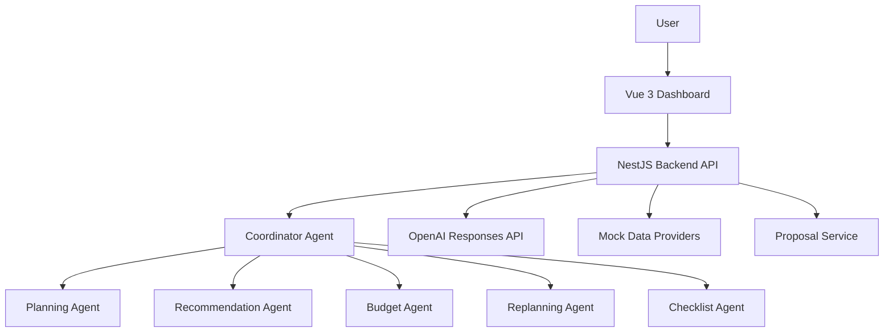

# Reiseplanungs-Agent

Ein intelligenter Reiseplanungs-Agent mit GenAI, der eine Reise nicht nur im Chat beschreibt, sondern als strukturiertes Dashboard plant. Der MVP zeigt Tagesplaene, Budget, Checkliste, Agent Insights und einen kontrollierten Replanning-Flow bei Wetteraenderungen.

Der Prototyp wurde gebaut, um zu demonstrieren, wie ein GenAI-Agent Vorschlaege begruendet, Alternativen anbietet und kritische Planaenderungen erst nach Nutzerbestaetigung uebernimmt.

## Features

- Reiseplanung fuer ein Demo-Szenario
- Budgetplanung mit deterministischer Berechnung
- Tagesplaene mit Zeitfenstern
- Restaurant-, Museums- und Aktivitaetsvorschlaege
- Agent Insights fuer transparente Agentenschritte
- Chat mit OpenAI-/Fallback-Antworten
- Replanning bei Wetteraenderungen
- Simulation von Regen an Tag 2
- Proposal Flow mit Accept/Reject
- OpenAI Responses API Integration

## Architekturuebersicht

```text
Vue 3 Dashboard
↓
NestJS Backend
↓
Coordinator Agent
↓
Specialized Agent Services
↓
OpenAI Responses API
```



Das Backend ist die Source of Truth fuer Plan, Budget, Proposals und Bestaetigungsstatus. Das Frontend rendert strukturierte Daten und loest Nutzeraktionen aus, trifft aber keine finalen Business-Entscheidungen.

## Agentenarchitektur

| Agent | Verantwortung |
| --- | --- |
| Coordinator Agent | Routet Nutzeranfragen, koordiniert Spezialagenten, fuehrt Ergebnisse zusammen und entscheidet, wann Nutzerbestaetigung erforderlich ist. |
| Planning Agent | Erstellt Tagesstruktur, Zeitfenster und sinnvolle Reihenfolgen im Reiseplan. |
| Recommendation Agent | Waehlt Restaurants, Museen, Sehenswuerdigkeiten und Aktivitaeten aus und bewertet Alternativen. |
| Budget Agent | Prueft Budgetdaten und liefert Budgethinweise; die finale Berechnung bleibt deterministisch im BudgetService. |
| Replanning Agent | Reagiert auf Wetteraenderungen, erkennt betroffene Outdoor-Aktivitaeten und erstellt Aenderungsvorschlaege. |
| Checklist Agent | Erstellt Packliste, Dokumentenliste und einfache Reisevorbereitungen. |

## Tech Stack

| Bereich | Technologie |
| --- | --- |
| Frontend | Vue 3 |
| State Management | Pinia |
| Routing | Vue Router |
| Backend | NestJS |
| Sprache | TypeScript |
| LLM | OpenAI Responses API |
| Datenbank MVP 1 | In-Memory |
| Datenbank MVP 2 | PostgreSQL |
| Build Tool | Vite |
| Monorepo | npm Workspaces |

## Projektstruktur

```text
travel-agent/
|-- package.json
|-- README.md
|-- spec_travel_agent.md
|-- frontend/
|   |-- index.html
|   |-- vite.config.ts
|   `-- src/
|       |-- components/
|       |   |-- dashboard/
|       |   |-- chat/
|       |   |-- trip/
|       |   |-- budget/
|       |   |-- checklist/
|       |   |-- agent-insights/
|       |   `-- replanning/
|       |-- views/
|       |-- stores/
|       |-- services/
|       |-- router/
|       `-- assets/
|-- backend/
|   `-- src/
|       |-- modules/
|       |   |-- travel/
|       |   |-- agent/
|       |   |-- openai/
|       |   |-- mock-data/
|       |   |-- weather/
|       |   |-- budget/
|       |   `-- proposal/
|       |-- agents/
|       |-- providers/
|       |-- dto/
|       |-- common/
|       `-- config/
|-- shared/
|   `-- src/
|       |-- types/
|       |-- contracts/
|       `-- constants/
`-- docs/
    |-- architecture.md
    |-- api-contracts.md
    |-- domain-model.md
    |-- sequence-diagrams.md
    |-- project-structure.md
    `-- design-system.md
```

## Quick Start

### Voraussetzungen

- Node.js
- npm

### Installation

```bash
npm install
```

### Backend starten

```bash
npm run dev:backend
```

Das Backend laeuft standardmaessig unter:

```text
http://localhost:3000/api
```

### Frontend starten

```bash
npm run dev:frontend
```

### Anwendung oeffnen

```text
http://localhost:5173
```

## Demo Ablauf

### 1. Demo-Reise laden

Im Dashboard auf `Demo-Reise laden` klicken. Das Backend erzeugt eine feste Berlin-Reise fuer 3 Tage, 2 Personen, 600 EUR Budget und Interessen wie Museen, gutes Essen, Sehenswuerdigkeiten und Spaziergaenge.

### 2. Tagesplan analysieren

Der Tagesplan zeigt Zeitfenster, Aktivitaeten, Orte, Kategorien, Kosten, Indoor/Outdoor-Status und Begruendungen.

### 3. Chatfrage stellen

Im Chat kann eine Frage zum Plan gestellt werden, zum Beispiel warum eine Aktivitaet ausgewaehlt wurde. Die Antwort kommt ueber den Coordinator Agent und die OpenAI-/Fallback-Integration.

### 4. Regen an Tag 2 simulieren

Der Button `Regen an Tag 2 simulieren` sendet ein Wetterereignis an das Backend. Outdoor-Aktivitaeten an Tag 2 werden erkannt.

### 5. Proposal ansehen

Das Dashboard zeigt ein pending Replanning Proposal mit Grund, betroffenen Tagen, PlanChanges und Budgetvergleich.

### 6. Accept

Mit `Aenderungen uebernehmen` wird das Proposal akzeptiert. Erst dann ersetzt das Backend den aktiven Plan durch den vorgeschlagenen Plan.

### 7. Budgetaenderung nachvollziehen

Das Budgetpanel zeigt die aktualisierten geplanten Kosten, Restbudget und Kategorieaufteilung.

### 8. Neue Demo laden

Eine neue Demo-Reise kann geladen werden, um den Ablauf erneut sauber zu starten.

### 9. Reject demonstrieren

Nach erneuter Wettersimulation kann `Ablehnen` geklickt werden. Der aktive Plan bleibt unveraendert.

## Screenshots

### Dashboard

_Bild folgt_

### Proposal Flow

_Bild folgt_

### Agent Insights

_Bild folgt_

## API Uebersicht

| Endpoint | Beschreibung |
| --- | --- |
| `GET /api/health` | Prueft, ob das Backend erreichbar ist. |
| `POST /api/trips/demo` | Laedt die feste Berlin-Demo-Reise fuer MVP 1. |
| `GET /api/trips/:tripId` | Liefert den aktuellen Trip-Zustand mit aktivem Plan, Budget, Checkliste und pending Proposal. |
| `POST /api/trips/:tripId/chat` | Sendet eine Chat-Nachricht an den Coordinator Agent und liefert Antwort, Plan, Proposal-Status und Agent Insights. |
| `POST /api/trips/:tripId/simulate-weather` | Simuliert ein Wetterereignis und erzeugt bei Bedarf ein pending Replanning Proposal. |
| `POST /api/trips/:tripId/proposals/:proposalId/accept` | Uebernimmt ein pending Proposal und setzt den vorgeschlagenen Plan als aktiven Plan. |
| `POST /api/trips/:tripId/proposals/:proposalId/reject` | Lehnt ein pending Proposal ab und laesst den aktiven Plan unveraendert. |

## Aktueller Projektstatus

| Feature | Status |
| --- | --- |
| Dashboard | ✅ |
| Chat | ✅ |
| Budget | ✅ |
| Proposal Flow | ✅ |
| Wettersimulation | ✅ |
| OpenAI Integration | ✅ |
| AI Generated Travel Planning | ⏳ |
| PostgreSQL | ⏳ |
| Externe APIs | ⏳ |

## Roadmap

- Phase 7 - AI Generated Travel Planning
- Phase 8 - PostgreSQL
- Phase 9 - Externe APIs
- Phase 10 - Export & Praesentation

## Architekturentscheidungen

Die wichtigsten Architekturentscheidungen sind in [spec_travel_agent.md](./spec_travel_agent.md) dokumentiert, insbesondere:

- eigene NestJS-Orchestrierung statt LangChain/LangGraph
- Mock-Daten vor echten APIs
- dashboard-zentrierte UI statt Chat-only UI
- proposal-basierter Replanning-Flow
- deterministische Budgetberechnung statt LLM-basierter Budgetlogik

## Weitere Dokumentation

- [Architektur](./docs/architecture.md)
- [API Contracts](./docs/api-contracts.md)
- [Domain Model](./docs/domain-model.md)
- [Sequence Diagrams](./docs/sequence-diagrams.md)
- [Projektstruktur](./docs/project-structure.md)
- [Design System](./docs/design-system.md)

## Lizenz

MIT License.
