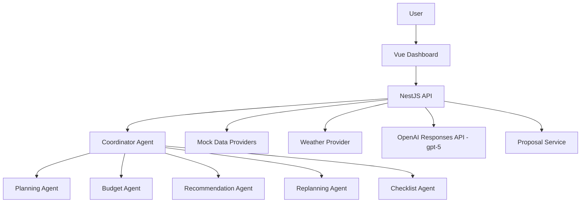
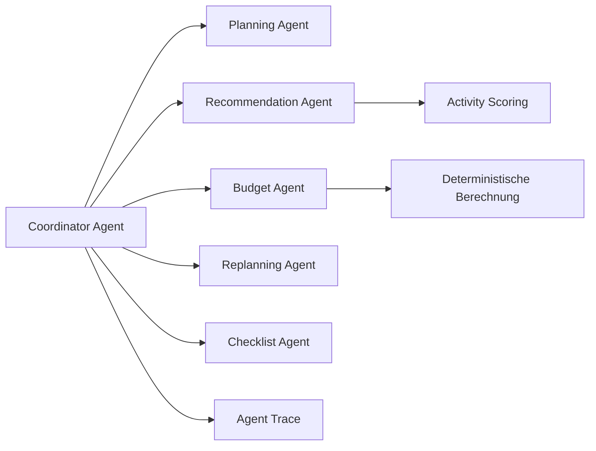
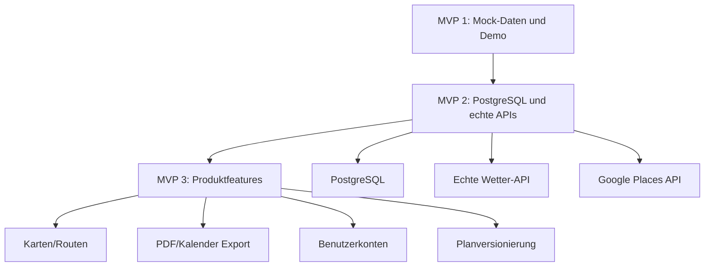

# Architektur: Intelligenter Reiseplanungs-Agent

## 1. Gesamtarchitektur

Die Anwendung besteht aus einer Vue-3-Dashboard-UI, einer NestJS-API, einer eigenen Agenten-Orchestrierung, Mock-/Provider-Schichten und der OpenAI Responses API mit `gpt-5`.



Kernprinzipien:

| Prinzip | Entscheidung |
| --- | --- |
| Source of Truth | Backend verwaltet Plan, Budget, Vorschlaege und Bestaetigungsstatus. |
| UI-Verantwortung | Frontend rendert strukturierte Daten und loest Nutzeraktionen aus. |
| Agentenlogik | Eigene Orchestrierung in NestJS, keine LangChain/LangGraph-Abhaengigkeit. |
| Budget | Deterministische Berechnung im Backend. |
| LLM | Empfehlungen, Begruendungen und strukturierte Vorschlaege mit `gpt-5`. |
| Aenderungen | Relevante Planaenderungen erst nach Nutzerbestaetigung. |

## 2. Frontend-Schicht

Das Frontend ist eine Vue-3-Anwendung mit TypeScript, Pinia und Vue Router. Die Hauptansicht ist `TravelDashboardView`.

Frontend-Bereiche:

- `ChatPanel`: dialogische Eingabe und Agentenantworten
- `DayPlanPanel`: Tagesplan mit Zeitfenstern
- `BudgetPanel`: Budgetstatus und Kategorien
- `RouteMapPanel`: MVP-1-Routenuebersicht mit Mock-Orten
- `ChecklistPanel`: Reisevorbereitungen
- `AgentInsightsPanel`: sichtbare Agentenschritte
- `ReplanningProposalPanel`: pending Vorschlaege mit Annahme/Ablehnung

Pinia Stores halten UI-Zustand, aber keine authoritative Business-Entscheidungen. Der aktive Plan kommt aus dem Backend.

## 3. Backend-Schicht

Das Backend ist eine NestJS-Anwendung mit klaren Modulen:

| Modul | Verantwortung |
| --- | --- |
| `TravelModule` | Trip-Endpunkte und Planabruf |
| `AgentModule` | Agenten und Orchestrierung |
| `OpenAiModule` | Responses API, Modellkonfiguration, strukturierte Outputs |
| `MockDataModule` | Aktivitaeten, Restaurants, Museen, Kostenannahmen |
| `WeatherModule` | Weather Provider Interface und MockWeatherProvider |
| `BudgetModule` | deterministische Budgetberechnung |
| `ProposalModule` | pending, accepted und rejected Replanning Proposals |

Das Backend normalisiert alle Ergebnisse, berechnet Budgetwerte neu und validiert strukturierte LLM-Ausgaben vor der Antwort an das Frontend.

## 4. Agenten-Schicht



Der Coordinator Agent startet Workflows, sammelt Ergebnisse und entscheidet, ob Nutzerbestaetigung erforderlich ist. Spezialagenten bearbeiten klar begrenzte Aufgaben.

Agenten:

| Agent | Aufgabe |
| --- | --- |
| Coordinator Agent | Routing, Workflow, Zusammenfuehrung, Confirmation-Entscheidung |
| Planning Agent | Tagesstruktur und Zeitfenster |
| Recommendation Agent | Aktivitaetenauswahl, Alternativen, Activity Scoring |
| Budget Agent | Budgetpruefung und Kategorien |
| Replanning Agent | Wetterreaktion und Aenderungsvorschlaege |
| Checklist Agent | Packliste, Dokumente, Vorbereitung |

## 5. Mock-/Provider-Schicht

MVP 1 nutzt Mock-Daten, aber ueber austauschbare Provider.

```ts
WeatherProvider {
  getWeatherForTrip(request: TripRequest): Promise<WeatherSummary[]>;
  simulateWeatherEvent(event: WeatherEvent): Promise<WeatherEvent>;
}
```

| MVP | Provider |
| --- | --- |
| MVP 1 | `MockWeatherProvider` |
| MVP 2 | `ExternalWeatherProvider` |

Mock-Daten muessen Berlin, Indoor/Outdoor-Klassifikation, Kosten, Dauer, Tags, einfache Locations und Score-relevante Attribute enthalten.

## 6. OpenAI Responses API Integration

Fuer MVP 1 wird `gpt-5` ueber die OpenAI Responses API verwendet.

Verwendung:

- strukturierte Reiseplanvorschlaege
- Empfehlungsbegruuendungen
- Alternative- und Replanning-Vorschlaege
- Chat-Zusammenfassungen

Nicht durch das LLM:

- finale Budgetberechnung
- persistente Zustandsaenderung
- automatische Uebernahme kritischer Plananpassungen

## 7. Warum eigene NestJS-Orchestrierung statt LangChain/LangGraph

Gruende:

- geringere Komplexitaet fuer MVP 1
- volle Kontrolle ueber Datenmodelle und Confirmation Flow
- bessere Nachvollziehbarkeit fuer Demo und Architektur
- einfache Integration in NestJS Services
- weniger Framework-Lock-in fuer spaetere Produktentscheidungen

Die Agenten sind in MVP 1 bewusst fachliche Services mit klaren Schnittstellen, nicht ein generisches Agentenframework.

## 8. Warum Dashboard-zentrierte UI statt reinem Chatbot

Ein reiner Chatbot wuerde Plan, Budget und Aenderungen schwer vergleichbar machen. Das Dashboard zeigt strukturierte Ergebnisse direkt.

Vorteile:

- Tagesplan ist scanbar
- Budget ist transparent
- Checkliste ist handlungsorientiert
- Replanning-Vorschlaege sind vergleichbar
- Agent Insights machen die Agentenarchitektur sichtbar

Der Chat bleibt wichtig, aber er ist ein Assistenzkanal, nicht die gesamte Anwendung.

## 9. Erweiterungspfad zu MVP 2 und MVP 3



MVP 1 legt dafuer Provider, Datenmodelle und Modulgrenzen frueh sauber an.
