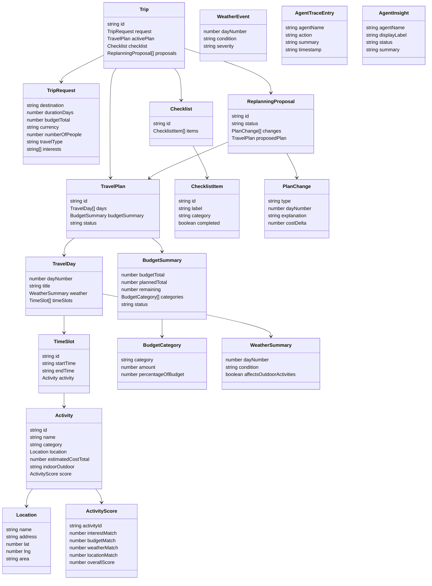

# Domain Model

## Ueberblick

Das Domain Model beschreibt die fachlichen Kernobjekte des Reiseplanungs-Agenten. MVP 1 arbeitet mit Mock-Daten, aber die Entitaeten sind so geschnitten, dass spaeter PostgreSQL, echte Wetterdaten, Places-Daten, Benutzerkonten und Planversionierung ergaenzt werden koennen.

```text
Trip
|-- TravelPlan
|   |-- TravelDay
|   |   `-- TimeSlot
|   |       `-- Activity
|   `-- BudgetSummary
|-- Checklist
`-- ReplanningProposal
```



## Entitaeten

### Trip

| Aspekt | Beschreibung |
| --- | --- |
| Zweck | Fachlicher Container fuer eine geplante Reise. |
| Wichtigste Felder | `id`, `request`, `activePlan`, `checklist`, `proposals`, `agentTrace`, `agentInsights`. |
| Beziehungen | Hat genau einen aktiven `TravelPlan`, eine `Checklist` und optional mehrere `ReplanningProposal` Eintraege. |
| MVP-1-Relevanz | Haelt den Demo-Zustand fuer Berlin und verbindet Plan, Budget, Checkliste und Vorschlaege. |
| MVP 2/3 Erweiterung | Persistenz in PostgreSQL, Benutzerbezug, Reisehistorie, Planversionen. |

### TripRequest

| Aspekt | Beschreibung |
| --- | --- |
| Zweck | Beschreibt die Eingabeparameter fuer eine Reiseplanung. |
| Wichtigste Felder | `destination`, `durationDays`, `budgetTotal`, `currency`, `numberOfPeople`, `travelType`, `interests`. |
| Beziehungen | Wird vom `Trip` gespeichert und vom Coordinator Agent als Ausgangspunkt genutzt. |
| MVP-1-Relevanz | Traegt die feste Demo-Reise und freie MVP-1-Planungsanfragen. |
| MVP 2/3 Erweiterung | Start-/Enddatum, Nutzerpraeferenzen, Barrierefreiheit, Pace, Hotelstandort. |

### TravelPlan

| Aspekt | Beschreibung |
| --- | --- |
| Zweck | Strukturierter Reiseplan mit Tagen und Budget. |
| Wichtigste Felder | `id`, `request`, `days`, `budgetSummary`, `status`, `createdAt`, `updatedAt`. |
| Beziehungen | Besteht aus `TravelDay` Objekten und genau einem `BudgetSummary`. |
| MVP-1-Relevanz | Zentrales Objekt fuer Dashboard und Replanning. |
| MVP 2/3 Erweiterung | Versionierung, gespeicherte Varianten, Export nach PDF/Kalender. |

### TravelDay

| Aspekt | Beschreibung |
| --- | --- |
| Zweck | Reisetag mit Tageswetter und Zeitfenstern. |
| Wichtigste Felder | `dayNumber`, `title`, `date`, `weather`, `timeSlots`. |
| Beziehungen | Gehoert zu einem `TravelPlan`, enthaelt mehrere `TimeSlot` Eintraege. |
| MVP-1-Relevanz | Macht den 3-Tage-Berlin-Plan scanbar. |
| MVP 2/3 Erweiterung | Echte Daten, Tagesrouten, Oeffnungszeiten, Kalender-Slots. |

### TimeSlot

| Aspekt | Beschreibung |
| --- | --- |
| Zweck | Ordnet eine Aktivitaet einem Zeitfenster zu. |
| Wichtigste Felder | `id`, `startTime`, `endTime`, `activity`, `notes`. |
| Beziehungen | Gehoert zu einem `TravelDay` und referenziert eine `Activity`. |
| MVP-1-Relevanz | Grundlage fuer Tagesplan und Replanning-Vergleich. |
| MVP 2/3 Erweiterung | Travel time, Konfliktpruefung, echte Oeffnungszeiten. |

### Activity

| Aspekt | Beschreibung |
| --- | --- |
| Zweck | Konkreter Programmpunkt wie Museum, Restaurant, Spaziergang oder Sehenswuerdigkeit. |
| Wichtigste Felder | `id`, `name`, `category`, `description`, `location`, `estimatedCostPerPerson`, `estimatedCostTotal`, `durationMinutes`, `indoorOutdoor`, `tags`, `reasoning`, `score`. |
| Beziehungen | Wird in `TimeSlot` verwendet, hat eine `Location` und optional einen `ActivityScore`. |
| MVP-1-Relevanz | Kernobjekt fuer Empfehlungen, Budget und Regen-Replanning. |
| MVP 2/3 Erweiterung | Externe Places-ID, echte Oeffnungszeiten, Fotos, Bewertungen, Buchungslinks. |

### ActivityScore

| Aspekt | Beschreibung |
| --- | --- |
| Zweck | Nachvollziehbare Bewertung einer Aktivitaet oder Alternative. |
| Wichtigste Felder | `activityId`, `interestMatch`, `budgetMatch`, `weatherMatch`, `locationMatch`, `overallScore`, `explanation`. |
| Beziehungen | Bewertet eine `Activity`; wird vom Recommendation Agent erzeugt. |
| MVP-1-Relevanz | Verhindert zufaellige Empfehlungen und macht Entscheidungen demo-tauglich erklaerbar. |
| MVP 2/3 Erweiterung | Weitere Faktoren wie Oeffnungszeiten, Entfernung, Reviews, Wartezeiten. |

### Location

| Aspekt | Beschreibung |
| --- | --- |
| Zweck | Ortsinformation fuer Aktivitaeten und spaetere Kartenfunktionen. |
| Wichtigste Felder | `name`, `address`, `lat`, `lng`, `area`. |
| Beziehungen | Wird von `Activity` referenziert. |
| MVP-1-Relevanz | Erlaubt schematische Routenuebersicht und Location Scoring. |
| MVP 2/3 Erweiterung | Echte Koordinaten, Places-ID, Routenoptimierung. |

### BudgetSummary

| Aspekt | Beschreibung |
| --- | --- |
| Zweck | Aggregierte Budgetbewertung des Plans. |
| Wichtigste Felder | `budgetTotal`, `plannedTotal`, `remaining`, `currency`, `perPersonTotal`, `categories`, `status`. |
| Beziehungen | Gehoert zu einem `TravelPlan` und enthaelt `BudgetCategory` Eintraege. |
| MVP-1-Relevanz | Zeigt, ob die Tagesplanung vor Ort im 600-EUR-Budget bleibt. |
| MVP 2/3 Erweiterung | Unterkunft, Anreise, echte Preise, Preisverlauf. |

### BudgetCategory

| Aspekt | Beschreibung |
| --- | --- |
| Zweck | Kostenaufschluesselung nach Kategorie. |
| Wichtigste Felder | `category`, `amount`, `percentageOfBudget`. |
| Beziehungen | Teil von `BudgetSummary`. |
| MVP-1-Relevanz | Kategorien fuer Aktivitaeten, Museen, Restaurants, lokale Mobilitaet und Pausen. |
| MVP 2/3 Erweiterung | Weitere Kategorien wie Hotel, Flug, Events, Reservierungen. |

### WeatherSummary

| Aspekt | Beschreibung |
| --- | --- |
| Zweck | Wetterstatus je Reisetag. |
| Wichtigste Felder | `dayNumber`, `condition`, `description`, `affectsOutdoorActivities`. |
| Beziehungen | Gehoert zu einem `TravelDay`. |
| MVP-1-Relevanz | Grundlage fuer Wetterhinweise und Replanning. |
| MVP 2/3 Erweiterung | Echte Vorhersage, Temperatur, Niederschlagswahrscheinlichkeit, Zeitfenster-Wetter. |

### WeatherEvent

| Aspekt | Beschreibung |
| --- | --- |
| Zweck | Ereignis, das Neuplanung ausloesen kann. |
| Wichtigste Felder | `dayNumber`, `condition`, `severity`, `description`. |
| Beziehungen | Wird vom `WeatherProvider` geliefert und vom Replanning Agent verarbeitet. |
| MVP-1-Relevanz | Simuliert "Tag 2: Regen". |
| MVP 2/3 Erweiterung | Automatische Events durch echte Wetter-API. |

### Checklist

| Aspekt | Beschreibung |
| --- | --- |
| Zweck | Sammlung von Reisevorbereitungen. |
| Wichtigste Felder | `id`, `tripId`, `items`. |
| Beziehungen | Gehoert zu einem `Trip` und enthaelt `ChecklistItem` Objekte. |
| MVP-1-Relevanz | Einfache Pack-, Dokumenten- und Vorbereitungsliste. |
| MVP 2/3 Erweiterung | Persistenz, Erinnerungen, Nutzerprofile, geteilte Listen. |

### ChecklistItem

| Aspekt | Beschreibung |
| --- | --- |
| Zweck | Einzelner abhakbarer Vorbereitungspunkt. |
| Wichtigste Felder | `id`, `label`, `category`, `completed`, `priority`. |
| Beziehungen | Teil einer `Checklist`. |
| MVP-1-Relevanz | Interaktiver, aber einfacher UI-Zustand. |
| MVP 2/3 Erweiterung | Faelligkeiten, Verantwortliche, Automationen. |

### ReplanningProposal

| Aspekt | Beschreibung |
| --- | --- |
| Zweck | Noch nicht uebernommener Vorschlag fuer Planaenderungen. |
| Wichtigste Felder | `id`, `planId`, `reason`, `affectedDayNumbers`, `changes`, `proposedPlan`, `budgetBefore`, `budgetAfter`, `status`, `createdAt`. |
| Beziehungen | Gehoert zu einem `Trip`, enthaelt `PlanChange` Eintraege und einen `proposedPlan`. |
| MVP-1-Relevanz | Erzwingt Nutzerbestaetigung vor Uebernahme der Regen-Neuplanung. |
| MVP 2/3 Erweiterung | Planversionen, Audit Trail, mehrere parallele Vorschlaege. |

### PlanChange

| Aspekt | Beschreibung |
| --- | --- |
| Zweck | Beschreibt eine konkrete Aenderung im Vorschlag. |
| Wichtigste Felder | `type`, `dayNumber`, `originalActivityId`, `newActivityId`, `explanation`, `costDelta`. |
| Beziehungen | Teil von `ReplanningProposal`. |
| MVP-1-Relevanz | Macht entfernte, hinzugefuegte, verschobene oder ersetzte Aktivitaeten sichtbar. |
| MVP 2/3 Erweiterung | Detaillierte Diffs, Rueckgaengig-Funktion, Versionierung. |

### AgentTraceEntry

| Aspekt | Beschreibung |
| --- | --- |
| Zweck | Technische und fachliche Kurzspur eines Agentenschritts. |
| Wichtigste Felder | `agentName`, `action`, `summary`, `timestamp`. |
| Beziehungen | Wird vom Coordinator gesammelt und kann in `Trip` oder Response liegen. |
| MVP-1-Relevanz | Basis fuer Demo-Transparenz. |
| MVP 2/3 Erweiterung | Persistenter Audit Trail, Debug-Ansicht, Monitoring. |

### AgentInsight

| Aspekt | Beschreibung |
| --- | --- |
| Zweck | UI-faehige Zusammenfassung eines Agentenschritts. |
| Wichtigste Felder | `agentName`, `displayLabel`, `status`, `summary`. |
| Beziehungen | Wird aus `AgentTraceEntry` abgeleitet oder direkt vom Coordinator geliefert. |
| MVP-1-Relevanz | Speist das `AgentInsightsPanel`. |
| MVP 2/3 Erweiterung | Erweiterte Erklaerungen, Filter, technische Details fuer Admins. |

