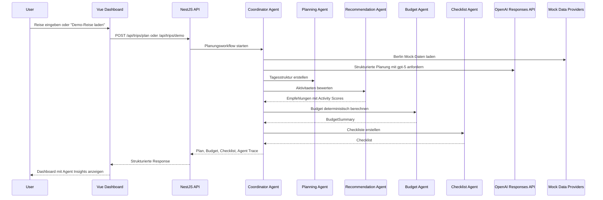
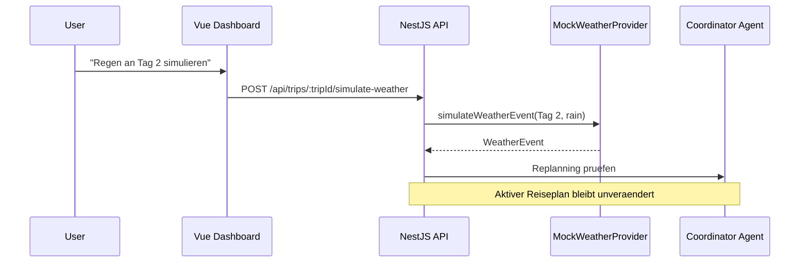
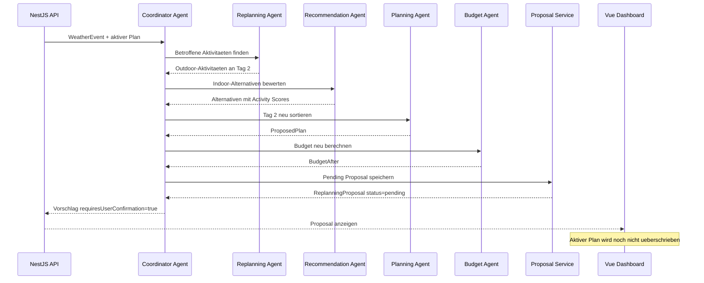
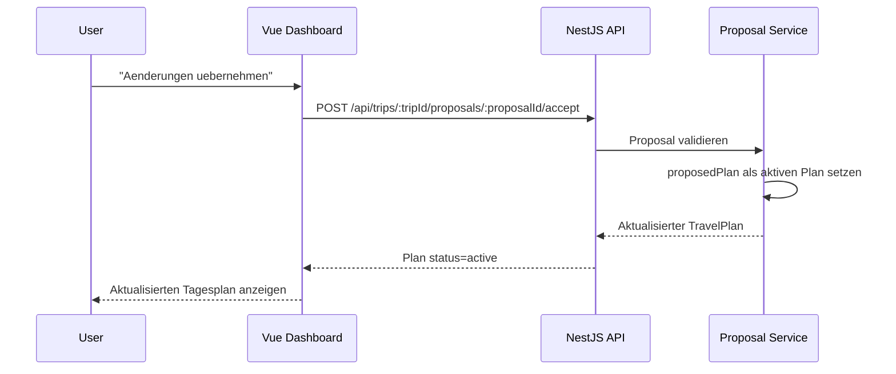
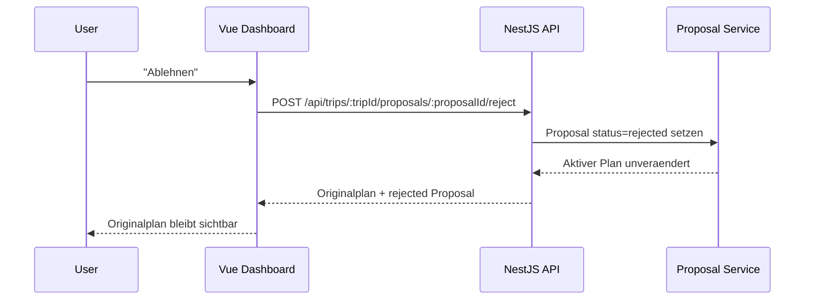
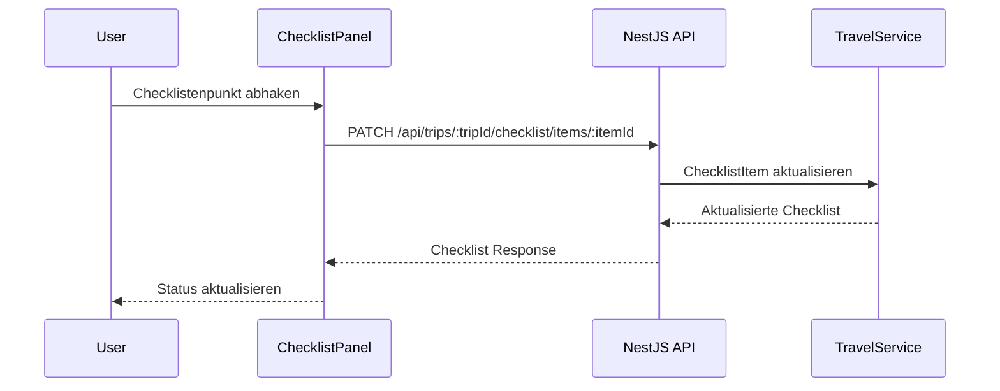

# Sequence Diagrams

## 1. Initiale Reiseplanung

## 2. Wetteraenderung simulieren

## 3. Neuplanungsvorschlag erstellen

## 4. Neuplanung uebernehmen

## 5. Neuplanung ablehnen

## 6. Checkliste aktualisieren

