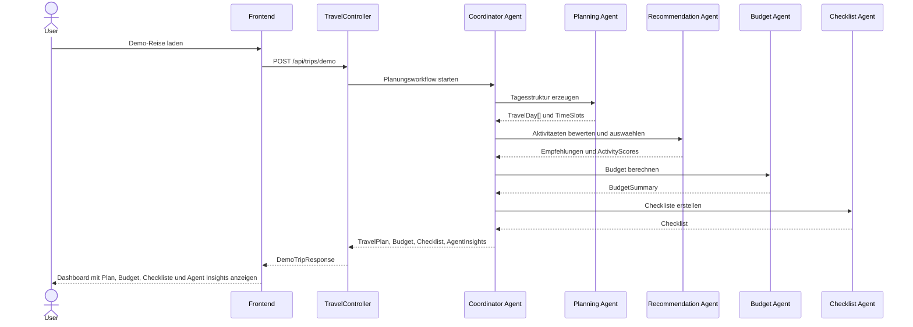
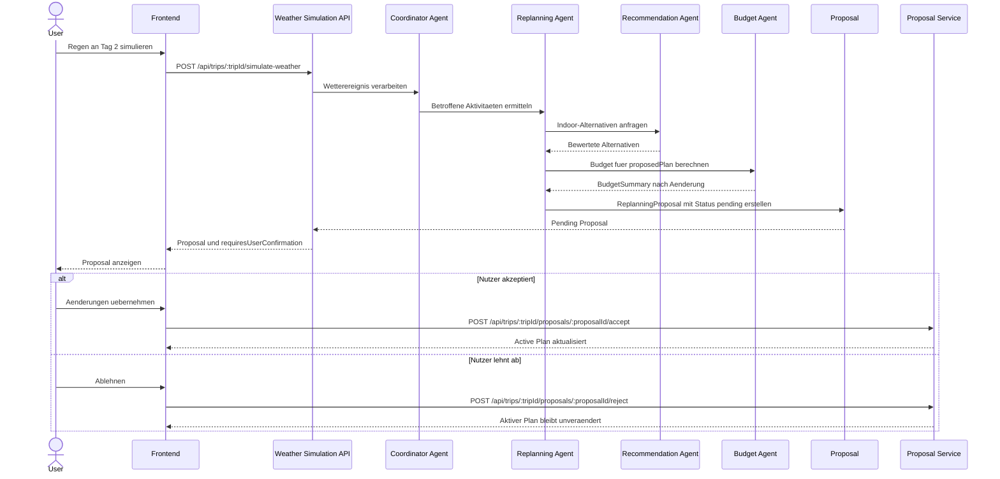

# Reiseplanungs-Agent

Version: MVP 1
Status: Active Development
Letzte Aktualisierung: 2026-06-02

## Projektstatus

| Bereich | Status |
| --- | --- |
| Architektur | ✅ |
| Backend | ✅ |
| Replanning | ✅ |
| OpenAI Integration | ✅ |
| Dashboard MVP | ✅ |
| Echte Reiseplanung | ⏳ |
| Externe APIs | ⏳ |
| PostgreSQL | ⏳ |

## MVP-1 Fortschritt

| Feature | Status |
| --- | --- |
| Demo-Reise | ✅ |
| Dashboard | ✅ |
| Chat | ✅ |
| Budget | ✅ |
| Checkliste | ✅ |
| Agent Insights | ✅ |
| Proposal Flow | ✅ |
| Wettersimulation | ✅ |
| OpenAI Integration | ✅ |
| AI Generated Travel Planning | ⏳ |
| PostgreSQL | ⏳ |
| Externe APIs | ⏳ |
| PDF Export | ⏳ |
| Kalender Export | ⏳ |

## Inhaltsverzeichnis

- [Projektstatus](#projektstatus)
- [MVP-1 Fortschritt](#mvp-1-fortschritt)
- [Inhaltsverzeichnis](#inhaltsverzeichnis)
- [1. Projektuebersicht](#1-projektuebersicht)
- [2. Ziel des Prototyps](#2-ziel-des-prototyps)
- [3. MVP-Abgrenzung](#3-mvp-abgrenzung)
- [4. Zielgruppe](#4-zielgruppe)
- [5. Kernfunktionen](#5-kernfunktionen)
- [6. User Stories](#6-user-stories)
- [7. Acceptance Criteria](#7-acceptance-criteria)
- [8. Demo-Szenario](#8-demo-szenario)
- [9. Systemarchitektur](#9-systemarchitektur)
- [10. Frontend-Architektur](#10-frontend-architektur)
- [11. Backend-Architektur](#11-backend-architektur)
- [12. Agentenarchitektur](#12-agentenarchitektur)
- [13. Agenten-Schnittstellen](#13-agenten-schnittstellen)
- [14. Datenmodelle](#14-datenmodelle)
- [15. API-Endpunkte](#15-api-endpunkte)
- [16. Mock-Daten-Konzept](#16-mock-daten-konzept)
- [17. Replanning-Logik](#17-replanning-logik)
- [18. Nutzerbestaetigungs-Flow](#18-nutzerbestaetigungs-flow)
- [19. Fehlerbehandlung](#19-fehlerbehandlung)
- [20. Erweiterbarkeit fuer MVP 2 und MVP 3](#20-erweiterbarkeit-fuer-mvp-2-und-mvp-3)
- [21. Nicht-Ziele fuer MVP 1](#21-nicht-ziele-fuer-mvp-1)
- [22. Technische Risiken](#22-technische-risiken)
- [Technische Anforderungen](#technische-anforderungen)
- [Architekturentscheidungen (ADR)](#architekturentscheidungen-adr)
- [Sequence Diagrams](#sequence-diagrams)
- [Offene Fragen](#offene-fragen)
- [24. Implementierungs-Roadmap](#24-implementierungs-roadmap)

# Technische Spezifikation: Intelligenter Reiseplanungs-Agent mit GenAI

## 1. Projektuebersicht

Das Projekt ist eine Web-App fuer intelligente Reiseplanung mit einem GenAI-Agenten. Die Anwendung soll zeigen, wie ein Agent eine Reise strukturiert plant, Vorschlaege begruendet, Alternativen anbietet und auf Aenderungen reagieren kann.

Die Anwendung ist dashboard-zentriert. Der Chat ist ein wichtiger Interaktionskanal, aber nicht die gesamte UI. Nutzer sollen Reiseinformationen sowohl dialogisch als auch visuell ueber Tagesplan, Budget, Karte/Routenuebersicht und Checkliste verstehen und steuern koennen.

Der Prototyp besteht aus:

- Vue 3 Frontend mit TypeScript, Pinia und Vue Router
- NestJS Backend mit TypeScript
- OpenAI Responses API mit dem Modell `gpt-5` fuer MVP 1
- eigener Agenten-Orchestrierung im Backend
- Mock-Daten fuer MVP 1
- spaeterer Erweiterbarkeit fuer PostgreSQL und externe APIs

### Tech-Stack MVP 1

| Bereich | Technologie | Entscheidung |
| --- | --- | --- |
| Frontend | Vue 3, TypeScript, Pinia, Vue Router | Dashboard-zentrierte Web-App |
| Backend | Node.js, NestJS, TypeScript | REST API und eigene Agenten-Orchestrierung |
| Agent / LLM | OpenAI Responses API, `gpt-5` | Strukturierte Outputs fuer Empfehlungen, Begruendungen und Vorschlaege |
| Agent Framework | Keines | Kein LangChain, kein LangGraph |
| Daten | Mock-Daten | PostgreSQL erst ab MVP 2 |
| Wetter | `MockWeatherProvider` | Echte Wetter-API erst ab MVP 2 |

## 2. Ziel des Prototyps

Der Prototyp soll demo-faehig zeigen, dass ein GenAI-Agent nicht nur Freitextantworten erzeugt, sondern strukturierte Reiseplanung als nachvollziehbaren Workflow ausfuehrt.

Ziele:

- Reiseplaene anhand von Ziel, Zeitraum, Budget, Personenanzahl, Reisetyp und Interessen erstellen
- Tagesplaene mit Zeitfenstern, Aktivitaeten, Restaurants, Museen und Sehenswuerdigkeiten erzeugen
- Budget nach Kategorien berechnen und sichtbar machen
- Vorschlaege mit kurzen, nachvollziehbaren Gruenden versehen
- Alternativen anbieten
- Wetteraenderungen simulieren
- betroffene Outdoor-Aktivitaeten erkennen
- Indoor-Alternativen vorschlagen
- Budget und Tagesplan neu berechnen
- Aenderungen erst nach expliziter Nutzerbestaetigung uebernehmen

Nicht Ziel des Prototyps ist eine produktionsreife Reisebuchungsplattform. MVP 1 dient als belastbarer technischer und produktfachlicher Proof of Concept.

## 3. MVP-Abgrenzung

### MVP 1

MVP 1 ist ein demo-faehiger Kernprototyp mit Mock-Daten.

Enthalten:

- Vue 3 Dashboard
- NestJS Backend
- OpenAI API Integration ueber Responses API
- verbindliche Nutzung von `gpt-5` fuer MVP 1
- eigene Agenten-Orchestrierung ohne LangChain und ohne LangGraph
- Reiseplanung nach Budget
- Tagesplaene fuer mehrere Tage
- Restaurant-, Museums- und Aktivitaetsvorschlaege mit Mock-Daten
- Activity Scoring fuer nachvollziehbare Empfehlungspriorisierung
- MockWeatherProvider ueber ein Weather Provider Interface
- simulierte Wetteraenderung
- Neuplanungsvorschlag
- Budget-Neuberechnung
- Nutzerbestaetigung vor Uebernahme von Aenderungen
- einfache Checkliste
- Agent Insights Panel zur sichtbaren Darstellung der Agentenschritte
- feste Demo-Reise per Button "Demo-Reise laden"
- Demo-Aktion per Button "Regen an Tag 2 simulieren"

### MVP 2

MVP 2 macht die Anwendung realistischer und persistenter.

Geplant:

- PostgreSQL
- Speicherung von Reisen
- echte Wetter-API
- Google Places API
- echte Oeffnungszeiten
- Standortdaten
- Nutzerpraeferenzen

### MVP 3

MVP 3 erweitert das Produkt um Komfort- und Produktivfeatures.

Geplant:

- Karten-/Routenansicht mit echten Routen
- PDF-Export
- Kalender-Export
- Flugstatus-API
- Hotel-/Preis-Daten
- Benutzerkonten
- Reisehistorie
- Versionierung von Planaenderungen

## 4. Zielgruppe

Primaere Zielgruppe:

- Personen, die Staedtereisen strukturiert planen moechten
- Paare, kleine Gruppen oder Einzelreisende
- Nutzer, die Empfehlungen moechten, aber Kontrolle ueber finale Entscheidungen behalten wollen

Sekundaere Zielgruppe:

- Produkt- und Technik-Stakeholder, die GenAI-Agenten in einer realistischen Fachanwendung sehen wollen
- Entwicklerteams, die eine klare Grundlage fuer Implementierung und Erweiterung brauchen

Typische Nutzerbeduerfnisse:

- schnelle Orientierung fuer ein Reiseziel
- Tagesplanung ohne manuelles Zusammensuchen vieler Quellen
- Budgettransparenz
- Alternativen bei schlechtem Wetter oder geaenderten Praeferenzen
- klare Begruendungen statt black-box Empfehlungen

## 5. Kernfunktionen

### Reiseplanung

- Eingabe von Reiseziel, Zeitraum, Budget, Personenanzahl, Reisetyp und Interessen
- Generierung eines strukturierten Reiseplans
- Darstellung nach Tagen und Zeitfenstern
- Beruecksichtigung von Budget und Interessen

### Empfehlungen

- Vorschlaege fuer Restaurants
- Vorschlaege fuer Museen
- Vorschlaege fuer Aktivitaeten und Sehenswuerdigkeiten
- Alternativen je Aktivitaet oder Kategorie
- Begruendung jeder relevanten Empfehlung

### Budget

- Gesamtbudget
- geplante Gesamtkosten
- verbleibendes Budget
- Kosten nach Kategorien
- Budgetwarnung bei Ueberschreitung oder engem Restbudget

### Replanning

- Simulation einer Wetteraenderung
- Erkennung betroffener Aktivitaeten
- Vorschlag fuer Ersatzaktivitaeten
- Neusortierung des Tagesplans
- Budget-Neuberechnung
- Begruendung der Aenderung
- Uebernahme erst nach Nutzerbestaetigung

### Checkliste

- Packliste
- Dokumentenliste
- Reisevorbereitungen
- einfache Statusverwaltung je Eintrag

### Dashboard

- Chatbereich
- Tagesplanbereich
- Budgetbereich
- Karte/Routenuebersicht
- Checklistenbereich
- Agent Insights Panel mit sichtbaren Agentenschritten

### Demo-Steuerung

- Button "Demo-Reise laden" laedt die feste Berlin-Demo mit 3 Tagen, 600 EUR Budget, 2 Personen, Reisetyp Paar und den Interessen Museen, gutes Essen, Sehenswuerdigkeiten und Spaziergaenge.
- Button "Regen an Tag 2 simulieren" loest fuer die aktive Demo-Reise ein Wetterereignis aus.
- Demo-Aktionen muessen auch ohne manuelle Texteingabe im Chat funktionieren.

### Budget-Scope MVP 1

Fuer MVP 1 umfasst das Budget ausschliesslich Kosten der Tagesplanung vor Ort:

- Aktivitaeten
- Museen
- Restaurants
- lokale Mobilitaet
- kleine Pausen/Cafes

Nicht enthalten sind:

- Unterkunft
- Flug oder Anreise
- echte Hotelpreise
- echte Flugpreise

Begruendung: MVP 1 fokussiert sich auf die nachvollziehbare Tagesplanung vor Ort. Unterkunft und Anreise wuerden den Demo-Scope vergroessern, ohne den Kernnutzen der Agenten-Orchestrierung besser zu zeigen.

## 6. User Stories

### Reise erstellen

Als Nutzer moechte ich eine Reise mit Ziel, Zeitraum, Budget, Personenanzahl, Reisetyp und Interessen angeben, damit der Agent einen passenden Reiseplan erstellt.

### Tagesplan ansehen

Als Nutzer moechte ich den Reiseplan nach Tagen und Zeitfenstern sehen, damit ich schnell verstehe, was wann geplant ist.

### Empfehlungen verstehen

Als Nutzer moechte ich bei Empfehlungen eine kurze Begruendung sehen, damit ich nachvollziehen kann, warum sie zu meiner Reise passen.

### Budget kontrollieren

Als Nutzer moechte ich sehen, wie sich die Kosten auf Kategorien verteilen, damit ich beurteilen kann, ob die Reise in mein Budget passt.

### Alternativen erhalten

Als Nutzer moechte ich Alternativen zu Aktivitaeten oder Restaurants sehen, damit ich bei Bedarf flexibel tauschen kann.

### Wetteraenderung simulieren

Als Demo-Nutzer moechte ich eine Wetteraenderung fuer einen Tag simulieren, damit ich sehe, wie der Agent auf neue Rahmenbedingungen reagiert.

### Neuplanung pruefen

Als Nutzer moechte ich vor der Uebernahme einer Neuplanung sehen, welche Aktivitaeten ersetzt oder verschoben werden, damit ich die Kontrolle behalte.

### Neuplanung bestaetigen

Als Nutzer moechte ich eine vorgeschlagene Aenderung bestaetigen oder ablehnen koennen, damit der Plan nicht ohne mein Einverstaendnis veraendert wird.

### Checkliste nutzen

Als Nutzer moechte ich eine einfache Checkliste erhalten und Punkte abhaken koennen, damit ich Reisevorbereitungen im Blick behalte.

## 7. Acceptance Criteria

### Allgemein

- Die Anwendung startet lokal als Frontend und Backend.
- Das Dashboard zeigt Chat, Tagesplan, Budget, Karte/Routenuebersicht, Checkliste und Agent Insights.
- Der Chat ist sichtbar, aber nicht die einzige relevante Interaktionsflaeche.
- Alle fuer MVP 1 benoetigten Daten koennen mit Mock-Daten erzeugt werden.
- Die feste Demo-Reise kann ueber den Button "Demo-Reise laden" erzeugt werden.
- Die Wetteraenderung kann ueber den Button "Regen an Tag 2 simulieren" ausgeloest werden.

### Reiseplanung

- Bei Eingabe des Demo-Szenarios wird ein 3-Tage-Plan fuer Berlin erzeugt.
- Jeder Tag enthaelt mehrere Zeitfenster.
- Aktivitaeten enthalten Name, Kategorie, Kosten, Dauer, Ort, Indoor/Outdoor-Kennzeichnung und Begruendung.
- Empfehlungen enthalten oder referenzieren einen Activity Score mit Interest-, Budget-, Weather-, Location- und Overall-Score.
- Der Plan enthaelt Restaurants, Museen, Sehenswuerdigkeiten und Spaziergaenge, sofern Budget und Wetter dies erlauben.

### Budget

- Das Budget wird fuer 2 Personen berechnet.
- Kosten werden nach Kategorien gruppiert.
- Das verbleibende Budget wird angezeigt.
- Bei einer Neuplanung wird das Budget aktualisiert.

### Replanning

- Eine simulierte Wetteraenderung "Tag 2: Regen" loest einen Neuplanungsvorschlag aus.
- Outdoor-Aktivitaeten an Tag 2 werden erkannt.
- Der Agent schlaegt passende Indoor-Alternativen vor.
- Der Agent erklaert kurz, warum die Aenderung sinnvoll ist.
- Der bestehende Plan wird nicht sofort ueberschrieben.
- Erst nach Nutzerbestaetigung wird die Aenderung uebernommen.
- Bei Ablehnung bleibt der bestehende Plan unveraendert.

### Agentenverhalten

- Agentenantworten enthalten strukturierte Daten fuer die UI.
- Agentische Entscheidungen sind nachvollziehbar dokumentiert.
- Spezialagenten haben klar getrennte Verantwortlichkeiten.
- Der Coordinator Agent entscheidet, wann eine Bestaetigung erforderlich ist.
- Das AgentInsightsPanel zeigt mindestens Coordinator, Planning, Recommendation, Budget und Checklist Agent nach initialer Planung.
- Nach der Wettersimulation zeigt das AgentInsightsPanel zusaetzlich den Replanning Agent.
- Beispielhafte Insights sind "Coordinator Agent: Anfrage analysiert", "Planning Agent: Tagesstruktur erstellt", "Recommendation Agent: Aktivitaeten bewertet", "Budget Agent: Budget geprueft" und "Checklist Agent: Checkliste erstellt".

## 8. Demo-Szenario

### Eingabe

- Reiseziel: Berlin
- Zeitraum: 3 Tage
- Budget: 600 EUR
- Anzahl Personen: 2
- Reisetyp: Paar
- Interessen: Museen, gutes Essen, Sehenswuerdigkeiten, Spaziergaenge

### Erwarteter initialer Ablauf

1. Nutzer gibt die Reisedaten ein oder klickt "Demo-Reise laden".
2. Coordinator Agent analysiert die Anfrage und ruft Planning, Recommendation, Budget und Checklist Agent auf.
3. Planning Agent erzeugt eine Tagesstruktur fuer 3 Tage.
4. Recommendation Agent bewertet passende Mock-Aktivitaeten, Restaurants und Museen mit Activity Scores.
5. Budget Agent berechnet Kosten und prueft das Gesamtbudget.
6. Checklist Agent erstellt eine einfache Vorbereitungs- und Packliste.
7. Coordinator Agent fuehrt Ergebnisse zusammen.
8. Frontend zeigt Plan, Budget, Chat-Zusammenfassung, Karte/Routenuebersicht, Checkliste und Agent Insights.

### Wetteraenderung

Simuliertes Event:

- Tag 2: Regen

Erwarteter Neuplanungsablauf:

1. Nutzer oder Demo-Control loest Wetteraenderung aus.
2. Coordinator Agent erkennt, dass Replanning erforderlich ist.
3. Replanning Agent identifiziert Outdoor-Aktivitaeten an Tag 2.
4. Recommendation Agent bewertet Indoor-Alternativen aus Mock-Daten anhand des Activity Scores.
5. Planning Agent sortiert Tag 2 neu.
6. Budget Agent berechnet Kosten neu.
7. Coordinator Agent erstellt einen Aenderungsvorschlag.
8. Frontend zeigt den Vorschlag als "Noch nicht uebernommen" und aktualisiert Agent Insights.
9. Nutzer bestaetigt oder lehnt ab.
10. Bei Bestaetigung wird der Plan aktualisiert.
11. Bei Ablehnung bleibt der Originalplan aktiv.

## 9. Systemarchitektur

### Ueberblick

Die Anwendung besteht aus drei Hauptschichten:

- Frontend: Vue Dashboard und UI-State
- Backend: REST API, Agenten-Orchestrierung und Mock-Datenzugriff
- LLM-Schicht: OpenAI Responses API fuer strukturierte GenAI-Ausgaben

### Architekturprinzipien

- Frontend rendert strukturierte Daten und trifft keine agentischen Kernentscheidungen.
- Backend ist Source of Truth fuer Plan, Budget, Vorschlaege und Bestaetigungsstatus.
- Agenten-Orchestrierung bleibt im NestJS Backend.
- LLM-Ausgaben werden validiert, bevor sie an das Frontend gehen.
- Fuer MVP 1 wird das OpenAI Modell `gpt-5` verwendet.
- Das LLM generiert Empfehlungen, Begruendungen und strukturierte Vorschlaege.
- Budgetberechnung bleibt deterministisch im Backend.
- Mock-Daten werden so modelliert, dass spaeter echte APIs und PostgreSQL anschliessbar sind.

### Datenfluss

1. Frontend sendet Reiseanfrage an Backend.
2. Backend erstellt eine Planungs-Session.
3. Coordinator Agent orchestriert Spezialagenten.
4. Spezialagenten nutzen Mock-Daten und bei Bedarf OpenAI Responses API.
5. Backend validiert und normalisiert das Ergebnis.
6. Frontend speichert UI-relevanten Zustand in Pinia.
7. Nutzerinteraktionen wie Bestaetigung oder Ablehnung gehen zurueck ans Backend.

## 10. Frontend-Architektur

### Frameworks

- Vue 3
- TypeScript
- Pinia
- Vue Router

### Seiten

- `TravelDashboardView`
  - Hauptansicht fuer MVP 1
  - zeigt Chat, Tagesplan, Budget, Karte/Routenuebersicht, Checkliste und Agent Insights
  - bietet Demo-Aktionen "Demo-Reise laden" und "Regen an Tag 2 simulieren"

- `NotFoundView`
  - einfache Fehlerseite fuer unbekannte Routen

### Hauptkomponenten

- `DashboardLayout`
  - responsive Dashboard-Struktur
  - ordnet Chat, Tagesplan, Budget, Karte, Checkliste und Agent Insights an

- `ChatPanel`
  - zeigt Nachrichten zwischen Nutzer und Agent
  - erlaubt Eingabe von Reiseanfragen und Folgefragen
  - zeigt agentische Statusmeldungen, z. B. "Budget wird geprueft"

- `TripInputPanel`
  - erfasst Ziel, Zeitraum, Budget, Personenanzahl, Reisetyp und Interessen
  - kann im MVP Teil des Chatbereichs oder als kompakter Formularbereich umgesetzt werden

- `DayPlanPanel`
  - zeigt Tagesplaene
  - erlaubt Auswahl einzelner Tage
  - zeigt Zeitfenster, Kosten, Kategorie, Ort, Indoor/Outdoor-Status und Begruendung

- `BudgetPanel`
  - zeigt Gesamtbudget, geplante Kosten, Restbudget und Kategorien
  - markiert Budgetrisiken

- `RouteMapPanel`
  - MVP 1: schematische Karte/Routenuebersicht auf Basis von Mock-Orten
  - MVP 3: echte Karte mit Routen

- `ChecklistPanel`
  - zeigt Checklistenpunkte
  - erlaubt Abhaken lokaler UI-Zustaende und spaeter persistenter Zustaende

- `AgentInsightsPanel`
  - zeigt, welche Agenten am aktuellen Ergebnis beteiligt waren
  - stellt Agent Trace Eintraege als kurze, demo-taugliche Statusliste dar
  - Beispiel: "Coordinator Agent: Anfrage analysiert"
  - macht die Backend-Agentenarchitektur in der UI sichtbar
  - ist fuer MVP 1 read-only und dient Transparenz, nicht Steuerung

- `ReplanningProposalPanel`
  - zeigt vorgeschlagene Aenderungen
  - hebt entfernte, verschobene und neue Aktivitaeten hervor
  - bietet Aktionen "Uebernehmen" und "Ablehnen"

### Pinia Stores

- `tripStore`
  - aktive Reise
  - Tagesplan
  - aktiver Tag
  - Planstatus

- `chatStore`
  - Chat-Nachrichten
  - Ladezustand
  - Agentenstatus

- `budgetStore`
  - Budgetsummary
  - Kategorieaufteilung

- `proposalStore`
  - offener Neuplanungsvorschlag
  - Bestaetigungsstatus

- `checklistStore`
  - Checklistenpunkte

- `agentInsightsStore`
  - Agent Trace Eintraege
  - zuletzt ausgefuehrte Agentenschritte
  - Status je Agent fuer Demo-Transparenz

### Frontend-Zustaende

- `idle`
- `planning`
- `plan_ready`
- `replanning`
- `proposal_pending`
- `proposal_applied`
- `error`

## 11. Backend-Architektur

### Framework

- Node.js
- NestJS
- TypeScript

### Module

- `TravelModule`
  - REST-Endpunkte fuer Reiseplanung und Planabruf

- `AgentModule`
  - Coordinator Agent
  - Spezialagenten
  - gemeinsame Agenten-Typen

- `OpenAiModule`
  - Kapselung der OpenAI Responses API
  - Prompt- und Response-Schema-Verwaltung

- `MockDataModule`
  - Zugriff auf Mock-Aktivitaeten, Restaurants, Museen, Wetterdaten und Kosten

- `WeatherModule`
  - definiert das Weather Provider Interface
  - nutzt in MVP 1 `MockWeatherProvider`
  - bereitet MVP 2 fuer `ExternalWeatherProvider` vor

- `BudgetModule`
  - deterministische Budgetberechnung
  - Validierung von Kosten

- `ProposalModule`
  - Verwaltung von offenen Aenderungsvorschlaegen
  - Uebernehmen oder Ablehnen von Vorschlaegen

### Services

- `TravelService`
  - erstellt und verwaltet Reise-Sessions
  - aggregiert Agentenergebnisse

- `AgentOrchestratorService`
  - fuehrt Coordinator Workflow aus
  - ruft Spezialagenten in definierter Reihenfolge auf

- `OpenAiService`
  - kapselt API-Aufrufe
  - verwendet fuer MVP 1 verbindlich das Modell `gpt-5`
  - erzwingt strukturierte Ausgabeformate
  - behandelt Fehler, Timeouts und Fallbacks

- `MockDataService`
  - liefert Mock-Entitaeten
  - filtert nach Stadt, Kategorie, Wettertauglichkeit und Kosten

- `WeatherProvider`
  - abstrahiert Wetterdaten und Wettersimulation
  - MVP 1: `MockWeatherProvider`
  - MVP 2: `ExternalWeatherProvider`

- `BudgetService`
  - berechnet Kosten
  - erkennt Budgetueberschreitungen

- `ProposalService`
  - erzeugt pending proposals
  - wendet bestaetigte Vorschlaege auf den aktiven Plan an

### Backend-Prinzipien

- LLMs generieren Empfehlungen und Begruendungen, aber Budgetberechnung erfolgt deterministisch.
- Kritische Zustandsaenderungen benoetigen explizite API-Aktion.
- Externe API-Adapter werden spaeter hinter klaren Interfaces ergaenzt.
- Responses werden serverseitig validiert und normalisiert.
- Das Weather Provider Interface wird bereits in MVP 1 eingefuehrt, obwohl nur Mock-Wetter genutzt wird.

### Weather Provider Interface

```ts
WeatherProvider {
  getWeatherForTrip(request: TripRequest): Promise<WeatherSummary[]>;
  simulateWeatherEvent(event: WeatherEvent): Promise<WeatherEvent>;
}
```

Fuer MVP 1:

```ts
MockWeatherProvider
```

Fuer MVP 2:

```ts
ExternalWeatherProvider
```

## 12. Agentenarchitektur

Die Agentenarchitektur besteht aus einem Coordinator Agent und mehreren spezialisierten Agenten. Es wird keine externe Agentenframework-Bibliothek wie LangChain oder LangGraph verwendet. Fuer MVP 1 wird das Modell `gpt-5` ueber die OpenAI Responses API genutzt.

Wichtige Regeln:

- Das LLM generiert Empfehlungen, Begruendungen und strukturierte Vorschlaege.
- Budgetberechnung bleibt deterministisch im Backend.
- Kritische Zustandsaenderungen brauchen Nutzerbestaetigung.
- Agentenschritte werden als Agent Trace erfasst und im AgentInsightsPanel sichtbar gemacht.

### Coordinator Agent

Verantwortlich fuer:

- Routing der Nutzeranfragen
- Koordination der Spezialagenten
- Zusammenfuehrung der Ergebnisse
- Entscheidung, wann Nutzerbestaetigung erforderlich ist
- Erzeugung einer finalen, UI-faehigen Antwort

Der Coordinator Agent ist der einzige Agent, der Workflows startet und beendet. Spezialagenten liefern Teilergebnisse, treffen aber keine globalen Produktentscheidungen.

### Planning Agent

Verantwortlich fuer:

- Erstellung des Reiseplans
- Tagesplanung
- Strukturierung nach Tagen und Zeitfenstern
- Einordnung von Aktivitaeten in sinnvolle Reihenfolgen

### Budget Agent

Verantwortlich fuer:

- Budgetberechnung
- Budgetpruefung
- Kostenaufteilung nach Kategorien
- Hinweise bei knappem oder ueberschrittenem Budget

Budgetberechnungen muessen deterministisch nachvollziehbar sein. Der LLM-Anteil darf Erklaertexte liefern, aber keine unvalidierten Summen als Wahrheit setzen.

### Recommendation Agent

Verantwortlich fuer:

- Restaurantvorschlaege
- Museumsvorschlaege
- Aktivitaetsvorschlaege
- Alternativen
- Begruendungen der Empfehlungen
- Activity Scoring nach Interessen, Budget, Wetter und Lage

Der Recommendation Agent waehlt Aktivitaeten nicht zufaellig aus. Er priorisiert Kandidaten anhand von `ActivityScore`. Beispiel: "Das Deutsche Technikmuseum wurde gewaehlt, weil es wettergeeignet ist, zu den Interessen passt und im Budget bleibt."

### Replanning Agent

Verantwortlich fuer:

- Reaktion auf Wetteraenderungen
- Erkennung betroffener Aktivitaeten
- Verschieben von Aktivitaeten
- Ersetzen von Outdoor-Aktivitaeten durch Indoor-Aktivitaeten
- Erstellen eines Aenderungsvorschlags

### Checklist Agent

Verantwortlich fuer:

- Packliste
- Dokumentenliste
- Reisevorbereitungen
- Priorisierung einfacher Vorbereitungsaufgaben

## 13. Agenten-Schnittstellen

### Gemeinsames Agent Request Format

Jeder Agent erhaelt einen strukturierten Kontext:

```ts
AgentContext {
  tripRequest: TripRequest;
  currentPlan?: TravelPlan;
  mockData?: MockDataBundle;
  weatherSummary?: WeatherSummary[];
  weatherEvent?: WeatherEvent;
  userMessage?: string;
  constraints: PlanningConstraints;
}
```

### Gemeinsames Agent Response Format

Jeder Agent liefert ein strukturiertes Ergebnis:

```ts
AgentResult<T> {
  agentName: string;
  status: "success" | "partial" | "failed";
  data: T;
  reasoningSummary: string;
  scores?: ActivityScore[];
  warnings: string[];
}
```

### Recommendation Agent Output

```ts
RecommendationResult {
  selectedActivities: Activity[];
  alternatives: Activity[];
  scores: ActivityScore[];
  reasoningSummary: string;
}
```

### Coordinator Output

```ts
CoordinatorResult {
  message: string;
  plan?: TravelPlan;
  budget?: BudgetSummary;
  checklist?: Checklist;
  proposal?: ReplanningProposal;
  requiresUserConfirmation: boolean;
  agentTrace: AgentTraceEntry[];
  agentInsights: AgentInsight[];
}
```

### Agent Trace

Der Agent Trace soll fuer MVP 1 im AgentInsightsPanel sichtbar sein. Er dient nicht als technisches Debug-Protokoll fuer alle Details, sondern als demo-taugliche Zusammenfassung der Agentenarbeit.

```ts
AgentTraceEntry {
  agentName: string;
  action: string;
  summary: string;
  timestamp: string;
}
```

```ts
AgentInsight {
  agentName: string;
  displayLabel: string;
  status: "pending" | "running" | "completed" | "failed";
  summary: string;
}
```

Beispielhafte Anzeige:

- Coordinator Agent: Anfrage analysiert
- Planning Agent: Tagesstruktur erstellt
- Recommendation Agent: Aktivitaeten bewertet
- Budget Agent: Budget geprueft
- Replanning Agent: Wetteraenderung verarbeitet
- Checklist Agent: Checkliste erstellt

### Strukturierte LLM-Ausgaben

OpenAI Responses API soll mit `gpt-5` so genutzt werden, dass Antworten in validierbaren Strukturen zurueckkommen. Freitext darf fuer Chatnachrichten und Begruendungen genutzt werden, aber UI-kritische Daten muessen als strukturierte Objekte vorliegen.

## 14. Datenmodelle

### TripRequest

```ts
TripRequest {
  destination: string;
  startDate?: string;
  endDate?: string;
  durationDays: number;
  budgetTotal: number;
  currency: "EUR";
  numberOfPeople: number;
  travelType: "solo" | "couple" | "family" | "group";
  interests: string[];
}
```

### TravelPlan

```ts
TravelPlan {
  id: string;
  request: TripRequest;
  days: TravelDay[];
  budgetSummary: BudgetSummary;
  status: "draft" | "active" | "proposal_pending";
  createdAt: string;
  updatedAt: string;
}
```

### TravelDay

```ts
TravelDay {
  dayNumber: number;
  title: string;
  date?: string;
  weather?: WeatherSummary;
  timeSlots: TimeSlot[];
}
```

### TimeSlot

```ts
TimeSlot {
  id: string;
  startTime: string;
  endTime: string;
  activity: Activity;
  notes?: string;
}
```

### Activity

```ts
Activity {
  id: string;
  name: string;
  category: "museum" | "restaurant" | "sightseeing" | "walk" | "activity" | "transport" | "break";
  description: string;
  location: Location;
  estimatedCostPerPerson: number;
  estimatedCostTotal: number;
  durationMinutes: number;
  indoorOutdoor: "indoor" | "outdoor" | "mixed";
  tags: string[];
  reasoning: string;
  score?: ActivityScore;
  source: "mock" | "openai" | "external_api";
}
```

### ActivityScore

```ts
ActivityScore {
  activityId: string;
  interestMatch: number;
  budgetMatch: number;
  weatherMatch: number;
  locationMatch: number;
  overallScore: number;
  explanation: string;
}
```

Score-Werte liegen im Bereich von 0 bis 1. `overallScore` wird aus den Teilwerten berechnet und dient der Priorisierung. Die genaue Gewichtung kann fuer MVP 1 einfach gehalten werden, muss aber dokumentiert und deterministisch nachvollziehbar sein.

### Location

```ts
Location {
  name: string;
  address?: string;
  lat?: number;
  lng?: number;
  area?: string;
}
```

### BudgetSummary

```ts
BudgetSummary {
  budgetTotal: number;
  plannedTotal: number;
  remaining: number;
  currency: "EUR";
  perPersonTotal: number;
  categories: BudgetCategory[];
  status: "within_budget" | "near_limit" | "over_budget";
}
```

### BudgetCategory

```ts
BudgetCategory {
  category: string;
  amount: number;
  percentageOfBudget: number;
}
```

### WeatherEvent

```ts
WeatherEvent {
  dayNumber: number;
  condition: "sunny" | "cloudy" | "rain" | "storm" | "snow";
  severity: "low" | "medium" | "high";
  description: string;
}
```

### WeatherSummary

```ts
WeatherSummary {
  dayNumber: number;
  condition: "sunny" | "cloudy" | "rain" | "storm" | "snow";
  description: string;
  affectsOutdoorActivities: boolean;
}
```

### ReplanningProposal

```ts
ReplanningProposal {
  id: string;
  planId: string;
  reason: string;
  affectedDayNumbers: number[];
  changes: PlanChange[];
  proposedPlan: TravelPlan;
  budgetBefore: BudgetSummary;
  budgetAfter: BudgetSummary;
  status: "pending" | "accepted" | "rejected";
  createdAt: string;
}
```

### PlanChange

```ts
PlanChange {
  type: "replace" | "move" | "remove" | "add";
  dayNumber: number;
  originalActivityId?: string;
  newActivityId?: string;
  explanation: string;
  costDelta: number;
}
```

### Checklist

```ts
Checklist {
  id: string;
  tripId: string;
  items: ChecklistItem[];
}
```

### ChecklistItem

```ts
ChecklistItem {
  id: string;
  label: string;
  category: "packing" | "documents" | "booking" | "preparation";
  completed: boolean;
  priority: "low" | "medium" | "high";
}
```

## 15. API-Endpunkte

### Demo-Reise laden

`POST /api/trips/demo`

Erstellt die feste MVP-1-Demo-Reise fuer Berlin:

- 3 Tage
- 600 EUR
- 2 Personen
- Reisetyp Paar
- Interessen: Museen, gutes Essen, Sehenswuerdigkeiten, Spaziergaenge

### Reiseplanung starten

`POST /api/trips/plan`

Request:

```json
{
  "destination": "Berlin",
  "durationDays": 3,
  "budgetTotal": 600,
  "currency": "EUR",
  "numberOfPeople": 2,
  "travelType": "couple",
  "interests": ["Museen", "gutes Essen", "Sehenswuerdigkeiten", "Spaziergaenge"]
}
```

Response:

```json
{
  "tripId": "trip_123",
  "message": "Ich habe einen 3-Tage-Plan fuer Berlin erstellt.",
  "plan": {},
  "budget": {},
  "checklist": {},
  "agentTrace": [],
  "agentInsights": []
}
```

### Reise abrufen

`GET /api/trips/:tripId`

Liefert den aktiven Plan inklusive Budget und Checkliste.

### Chat-Nachricht senden

`POST /api/trips/:tripId/chat`

Nimmt Nutzerfragen oder Aenderungswuensche entgegen und gibt eine Coordinator-Antwort zurueck.

### Wetteraenderung simulieren

`POST /api/trips/:tripId/simulate-weather`

Request:

```json
{
  "dayNumber": 2,
  "condition": "rain",
  "severity": "medium",
  "description": "Am zweiten Tag ist Regen vorhergesagt."
}
```

Response:

```json
{
  "message": "Fuer Tag 2 schlage ich eine wetterfeste Alternative vor.",
  "proposal": {},
  "requiresUserConfirmation": true
}
```

Diese API nutzt in MVP 1 den `MockWeatherProvider`. Sie darf den aktiven Plan nicht direkt ueberschreiben, sondern muss einen `ReplanningProposal` mit Status `pending` erzeugen.

### Vorschlag annehmen

`POST /api/trips/:tripId/proposals/:proposalId/accept`

Wendet den vorgeschlagenen Plan an und setzt den Vorschlagsstatus auf `accepted`.

### Vorschlag ablehnen

`POST /api/trips/:tripId/proposals/:proposalId/reject`

Laesst den aktiven Plan unveraendert und setzt den Vorschlagsstatus auf `rejected`.

### Checkliste aktualisieren

`PATCH /api/trips/:tripId/checklist/items/:itemId`

Request:

```json
{
  "completed": true
}
```

## 16. Mock-Daten-Konzept

Mock-Daten sollen MVP 1 stabil, demo-faehig und unabhaengig von externen Diensten machen.

### Mock-Datenarten

- Aktivitaeten
- Restaurants
- Museen
- Sehenswuerdigkeiten
- Spaziergaenge
- Wetterereignisse
- Wetterzusammenfassungen je Reisetag
- Kostenannahmen
- einfache Ortsdaten
- Activity Scores oder Score-relevante Attribute

### Anforderungen an Mock-Daten

- Berlin muss vollstaendig abgedeckt sein.
- Jede Aktivitaet muss Indoor/Outdoor klassifiziert sein.
- Jede Aktivitaet muss Kosten pro Person enthalten.
- Jede Aktivitaet muss Dauer enthalten.
- Jede Aktivitaet muss Tags enthalten, z. B. `museum`, `romantic`, `food`, `history`, `rain_safe`.
- Jede Aktivitaet muss eine einfache Location enthalten.
- Jede Aktivitaet muss Score-relevante Tags fuer Interessen, Budget, Wetter und Lage enthalten.
- Es muss ausreichend Indoor-Alternativen fuer Tag 2 geben.

### MockWeatherProvider

MVP 1 nutzt einen `MockWeatherProvider`, der fuer eine Reise eine einfache Wetterzusammenfassung liefert und simulierte Wetterereignisse akzeptiert.

```ts
WeatherProvider {
  getWeatherForTrip(request: TripRequest): Promise<WeatherSummary[]>;
  simulateWeatherEvent(event: WeatherEvent): Promise<WeatherEvent>;
}
```

Der `MockWeatherProvider` soll reproduzierbar arbeiten, damit die Demo stabil bleibt. Fuer das Demo-Szenario ist Tag 2 initial planbar und wird erst durch den Button "Regen an Tag 2 simulieren" wetterkritisch.

### Beispielhafte Mock-Kategorien

- Museen: Pergamonmuseum-Alternative, Neues Museum, Berlinische Galerie
- Restaurants: moderne deutsche Kueche, Casual Dining, Cafe
- Outdoor: Spaziergang Unter den Linden, East Side Gallery, Tiergarten
- Sehenswuerdigkeiten: Brandenburger Tor, Reichstag, Museumsinsel
- Indoor bei Regen: Museum, Galerie, Markthalle, historische Ausstellung

### Spaetere Austauschbarkeit

Mock-Daten sollen ueber ein Repository- oder Provider-Interface bereitgestellt werden. In MVP 2 koennen diese Provider durch PostgreSQL und externe API-Adapter ersetzt oder ergaenzt werden.

## 17. Replanning-Logik

### Ausloeser

Replanning wird ausgeloest durch:

- simuliertes Wetterereignis
- Nutzerwunsch nach Aenderung
- Budgetproblem
- spaeter: echte API-Aenderungen wie Flugstatus oder Oeffnungszeiten

### MVP-1-Regel fuer Regen

Wenn fuer einen Tag Regen simuliert wird:

1. Rufe das Wetterereignis ueber `WeatherProvider.simulateWeatherEvent` ab.
2. Finde alle Aktivitaeten an diesem Tag mit `indoorOutdoor = outdoor`.
3. Pruefe, ob `mixed` Aktivitaeten wetterkritisch sind.
4. Suche Indoor-Alternativen mit passenden Tags und aehnlicher Dauer.
5. Bewerte Alternativen mit `ActivityScore`.
6. Vermeide deutliche Budgetueberschreitungen.
7. Erhalte moeglichst die urspruengliche Tagesstruktur.
8. Berechne Budget neu.
9. Erstelle einen pending Vorschlag.

### Priorisierung von Alternativen

Alternativen werden nach folgenden Kriterien priorisiert:

- `weatherMatch`: wettergeeignet
- `interestMatch`: passend zu Interessen
- `budgetMatch`: gleiche oder niedrigere Kosten
- `locationMatch`: gleiche Stadtregion oder kurze Route
- passende Dauer
- Demo-Wert fuer Storytelling

Der `overallScore` entscheidet ueber die Reihenfolge. Bei aehnlichen Scores darf der Coordinator die demo-tauglichere Alternative bevorzugen, muss dies aber im `explanation` Feld begruenden.

### Begruendung

Jede Aenderung muss eine kurze Begruendung enthalten:

- warum die urspruengliche Aktivitaet betroffen ist
- warum die Alternative passt
- welche Budgetauswirkung entsteht
- welcher Activity Score fuer die Alternative ausschlaggebend war

## 18. Nutzerbestaetigungs-Flow

### Grundregel

Der aktive Reiseplan darf bei relevanten Aenderungen nicht automatisch veraendert werden.

Relevante Aenderungen:

- Austausch einer Aktivitaet
- Verschiebung eines Zeitfensters
- Budgetveraenderung
- Aenderung eines Tagesablaufs

### Flow

1. Backend erzeugt `ReplanningProposal` mit Status `pending`.
2. Frontend zeigt den Vorschlag sichtbar getrennt vom aktiven Plan.
3. Nutzer kann Details vergleichen.
4. Nutzer waehlt "Uebernehmen" oder "Ablehnen".
5. Bei "Uebernehmen" wird `accept` API aufgerufen.
6. Backend ersetzt den aktiven Plan durch `proposedPlan`.
7. Bei "Ablehnen" wird `reject` API aufgerufen.
8. Backend behaelt den aktiven Plan unveraendert.

### UI-Anforderungen

- Pending Proposal muss klar als Vorschlag markiert sein.
- Kostenveraenderung muss sichtbar sein.
- Entfernte und neue Aktivitaeten muessen unterscheidbar sein.
- Primaere Aktion: "Aenderungen uebernehmen"
- Sekundaere Aktion: "Ablehnen"

## 19. Fehlerbehandlung

### Frontend

- Ladezustand waehrend Planung und Neuplanung anzeigen
- Fehlernachricht bei API-Fehlern anzeigen
- vorhandenen Plan bei Fehler nicht verlieren
- erneutes Ausloesen der letzten Aktion erlauben

### Backend

- Validierung aller Requests
- strukturierte Fehlerantworten
- Timeout-Behandlung fuer OpenAI API
- Fallback auf deterministische Mock-Planung, falls LLM-Aufruf fehlschlaegt
- Logging der Agenten-Schritte

### LLM-spezifische Fehler

Moegliche Fehler:

- unvollstaendige strukturierte Antwort
- nicht validierbare Daten
- Timeout
- zu hohe Kosten oder falsche Summen
- Empfehlung ausserhalb der Mock-Daten

Behandlung:

- Response validieren
- fehlende optionale Felder mit Defaults ergaenzen
- kritische Fehler an Coordinator melden
- Budget immer serverseitig neu berechnen
- bei nicht reparierbarer Antwort kontrollierten Fehler liefern

## 20. Erweiterbarkeit fuer MVP 2 und MVP 3

### MVP 2

Erweiterungspunkte:

- PostgreSQL ueber Repository-Schicht
- Persistenz fuer Trips, Plans, Proposals, Checklist Items und User Preferences
- Austausch von `MockWeatherProvider` durch `ExternalWeatherProvider` fuer echte Wetter-API
- Places Provider Interface fuer Google Places API
- Location-Daten mit Koordinaten
- Oeffnungszeiten und Verfuegbarkeit

### MVP 3

Erweiterungspunkte:

- Map Provider fuer echte Karten- und Routenansicht
- Export Services fuer PDF und Kalender
- Flight Status Provider
- Hotel und Preis Provider
- Auth Module fuer Benutzerkonten
- History Module fuer Reisehistorie
- Versioning Module fuer Planversionen und Aenderungsvergleich

### Architekturvorgabe

Provider und Repositories sollen in MVP 1 schon so benannt und geschnitten werden, dass spaetere Austauschbarkeit moeglich ist, ohne die UI oder Agentenlogik gross umzubauen.

## 21. Nicht-Ziele fuer MVP 1

MVP 1 soll bewusst schlank bleiben.

Nicht enthalten:

- Benutzerkonten
- PostgreSQL
- echte Buchungen
- echte Hotelpreise
- echte Flugpreise
- Unterkunft
- Flug oder Anreise
- echte Flugstatusdaten
- echte Google Maps Integration
- echte Routenoptimierung
- echte Oeffnungszeiten
- Zahlungsfunktionen
- Mehrsprachigkeit
- mobile App
- komplexe Rechteverwaltung
- LangChain
- LangGraph

## 22. Technische Risiken

### LLM-Zuverlaessigkeit

Risiko:

- LLM kann unstrukturierte, falsche oder inkonsistente Daten erzeugen.

Massnahmen:

- strukturierte Responses
- fuer MVP 1 verbindlich `gpt-5` ueber OpenAI Responses API
- serverseitige Validierung
- deterministische Budgetberechnung
- Mock-Daten als harte Quelle fuer MVP 1
- kritische Zustandsaenderungen nur nach Nutzerbestaetigung

### Scope Creep

Risiko:

- Reiseplanung kann schnell zu komplex werden.

Massnahmen:

- MVP 1 strikt auf Demo-Szenario und Kernfunktionen begrenzen
- externe APIs erst ab MVP 2
- Kartenfunktion in MVP 1 nur schematisch

### UI-Ueberladung

Risiko:

- Chat, Plan, Budget, Karte und Checkliste koennen unuebersichtlich werden.

Massnahmen:

- Dashboard mit klaren Bereichen
- Tagesplan als zentrales Element
- Chat als Assistenzkanal, nicht als alleinige UI

### Kosten und Latenz

Risiko:

- LLM-Aufrufe koennen langsam oder teuer werden.

Massnahmen:

- wenige orchestrierte Aufrufe
- Mock-Datenfilterung vor LLM-Aufruf
- kurze strukturierte Prompts
- Caching fuer Demo-Daten moeglich

### Spaetere API-Integration

Risiko:

- Mock-Datenmodell passt nicht zu echten APIs.

Massnahmen:

- klare Provider-Interfaces
- Weather Provider Interface bereits in MVP 1
- Location-, Kategorie-, Kosten- und Wetterfelder frueh modellieren
- externe IDs optional vorsehen

### Modell- und Prompt-Kosten

Risiko:

- `gpt-5` kann je nach Antwortumfang Kosten und Latenz erhoehen.

Massnahmen:

- strukturierte, kompakte Outputs
- Mock-Daten vorfiltern
- Budgetberechnung nicht durch das LLM ausfuehren lassen
- Agentenaufrufe fuer MVP 1 auf demo-relevante Workflows begrenzen

## Technische Anforderungen

### Stack & Architektur - Entscheidungen final

| Komponente | Entscheidung | Begruendung |
| --- | --- | --- |
| Sprache | TypeScript | Einheitliche Sprache fuer Frontend, Backend und Shared Types reduziert Reibung, vermeidet doppelte Modellpflege und erhoeht die Typsicherheit im Monorepo. |
| Frontend | Vue 3 + Vite + Pinia + Vue Router | Vue 3 ermoeglicht eine schnelle, komponentenbasierte Dashboard-Web-App; Vite beschleunigt Entwicklung und Build; Pinia und Vue Router decken MVP-1-State und Navigation schlank ab. |
| Backend | Node.js + NestJS | NestJS liefert klare Modulgrenzen, Dependency Injection und Controller/Service-Strukturen, die gut zu API, Agenten-Orchestrierung und spaeteren Providern passen. |
| Monorepo | npm Workspaces | Frontend, Backend und Shared Types bleiben gemeinsam versioniert; API- und Domain-Typen koennen konsistent zwischen den Packages genutzt werden. |
| LLM | OpenAI Responses API | Die Responses API ist fuer agentische Workflows, Assistenzantworten und strukturierte Ausgaben geeignet und bleibt im Backend zentral gekapselt. |
| Modell MVP 1 | `gpt-5` | Fuer MVP 1 wird ein leistungsfaehiges Modell als Standard gesetzt, damit Chatantworten und Begruendungen demo-tauglich und stabil wirken. |
| Agenten-Orchestrierung | Eigene NestJS-Orchestrierung | Die Workflows bleiben transparent, deterministisch kontrollierbar und eng an die fachlichen Services gebunden; das reduziert Framework-Overhead und erleichtert Reviews. |
| Agenten-Framework | Kein LangChain, kein LangGraph | MVP 1 benoetigt keine komplexe Graph- oder Chain-Abstraktion; eigene NestJS-Services reichen fuer Coordinator, Spezialagenten, Proposals und klare Verantwortlichkeiten aus. |
| Datenbank MVP 1 | In-Memory Storage | In-Memory Storage haelt den Demo-Prototyp schlank, schnell startbar und unabhaengig von Datenbanksetup oder Migrationen. |
| Datenbank MVP 2 | PostgreSQL | PostgreSQL ist fuer persistente Reisen, Nutzerpraeferenzen, Reisehistorie und spaetere relationale Abfragen geeignet. |
| Wetter MVP 1 | `MockWeatherProvider` | Mock-Wetter macht das Demo-Szenario reproduzierbar und erlaubt kontrolliertes Replanning ohne externe API-Abhaengigkeit. |
| Wetter MVP 2 | externe Wetter-API | Echte Wetterdaten werden erst relevant, wenn die Anwendung ueber die stabile Demo hinaus realistische Planung unterstuetzen soll. |
| Places MVP 1 | Mock-Daten | Kuratierte Mock-Aktivitaeten sichern stabile Empfehlungen, nachvollziehbare Scores und eine verlaessliche Berlin-Demo. |
| Places MVP 2 | Google Places API | Google Places kann spaeter echte Restaurants, Museen, Aktivitaeten, Standortdaten und Oeffnungszeiten liefern. |
| Budgetberechnung | Deterministischer `BudgetService` | Budgetwerte muessen nachvollziehbar, testbar und wiederholbar sein; das LLM darf erklaeren, aber keine unvalidierten Summen als Wahrheit setzen. |
| Replanning | Proposal-basierter Accept/Reject-Flow | Kritische Plan- und Budgetaenderungen werden nicht automatisch uebernommen, damit Nutzer Kontrolle behalten und der aktive Plan stabil bleibt. |
| UI | Dashboard-zentriert | Der Chat ist wichtig, aber Tagesplan, Budget, Route, Checkliste und Agent Insights muessen parallel sichtbar und steuerbar bleiben. |
| Testing MVP 1 | Manuelle PowerShell/API-Tests + TypeScript Checks | Fuer den Demo-Prototyp reichen reproduzierbare API-Flows, Build-/Typechecks und manuelle Browserpruefung; automatisierte E2E-Tests koennen spaeter folgen. |
| Export MVP 3 | PDF-Export + Kalender-Export | Exporte sind wertvolle Produktfeatures, gehoeren aber nicht in den MVP-1-Kern der agentischen Planung und Neuplanung. |

### Externe Schnittstellen

| Schnittstelle | Zweck | Status | Details |
| --- | --- | --- | --- |
| OpenAI Responses API | Chatantworten, Begruendungen, strukturierte Assistenz | vorbereitet / teilweise implementiert | Modell: `gpt-5`, Fallback ohne API-Key, Kapselung im `OpenAiService` |
| Wetter-API | echte Wetterdaten fuer Replanning | MVP 2 | in MVP 1 ueber `MockWeatherProvider` simuliert |
| Google Places API | Restaurants, Museen, Aktivitaeten | MVP 2 | in MVP 1 ueber `MockDataService` und kuratierte Berlin-Daten simuliert |
| Flugstatus-API | Flugzeitaenderungen | MVP 3 | spaeterer Replanning-Trigger fuer Anreise- und Tagesplananpassungen |
| PDF Export | Reiseplan exportieren | MVP 3 | spaeteres Export Feature fuer teilbare Reiseplaene |
| Kalender Export | Tagesplan in Kalender uebernehmen | MVP 3 | spaeteres Export Feature fuer Zeitfenster und Aktivitaeten |

## Architekturentscheidungen (ADR)

### ADR-001: Eigene NestJS-Orchestrierung statt LangChain/LangGraph

**Status:** Angenommen

**Kontext:**

MVP 1 benoetigt einen nachvollziehbaren Agentenworkflow mit Coordinator Agent, spezialisierten Agent Services, Budgetpruefung, Proposal-Erzeugung und Nutzerbestaetigung. Die Anwendung ist eine NestJS-API mit klarer Service- und Modulstruktur. Externe Agentenframeworks wie LangChain oder LangGraph wuerden zusaetzliche Abstraktionen einfuehren.

**Entscheidung:**

Die Agenten-Orchestrierung wird als eigene NestJS-Orchestrierung umgesetzt. Der Coordinator Agent und die Spezialagenten werden als explizite Services modelliert. LangChain und LangGraph werden fuer MVP 1 nicht verwendet.

**Begruendung:**

Die eigene Orchestrierung haelt Verantwortlichkeiten sichtbar, testbar und reviewbar. Sie passt direkt zur vorhandenen NestJS-Dependency-Injection und vermeidet Framework-Komplexitaet, die fuer den MVP-1-Workflow nicht erforderlich ist. Kritische Entscheidungen wie Budgetberechnung, Replanning und Accept/Reject bleiben unter direkter Kontrolle des Backends.

**Konsequenzen:**

- Agentenworkflows bleiben transparent und leicht zu erklaeren.
- Es entsteht weniger externe Framework-Abhaengigkeit.
- Komplexere spaetere Agentengraphen muessen bei Bedarf selbst modelliert oder neu bewertet werden.
- Das Team traegt selbst Verantwortung fuer Orchestrierung, Tracing und Fehlerbehandlung.

### ADR-002: Mock-Daten vor echten APIs

**Status:** Angenommen

**Kontext:**

Die MVP-1-Demo soll stabil zeigen, wie Reiseplanung, Budget, Empfehlungen, Wetter-Replanning und Proposals zusammenspielen. Echte Wetter-, Places-, Flugstatus- oder Preisdaten koennen Latenz, Kosten, API-Limits, Datenqualitaetsprobleme und unvorhersehbares Demo-Verhalten verursachen.

**Entscheidung:**

MVP 1 nutzt kuratierte Mock-Daten und Mock Provider. Echte externe APIs werden erst ab MVP 2 bzw. MVP 3 integriert.

**Begruendung:**

Mock-Daten sichern eine reproduzierbare Berlin-Demo und erlauben gezielte Testfaelle wie "Regen an Tag 2". Sie reduzieren Integrationsrisiken und halten den MVP fokussiert auf Agenten-Orchestrierung, Replanning und UI-Darstellung.

**Konsequenzen:**

- Die Demo ist stabil und unabhaengig von externen Diensten.
- API-Adapter koennen spaeter hinter Provider-Interfaces ergaenzt werden.
- MVP 1 bildet keine vollstaendige Realwelt-Datenqualitaet ab.
- Spaetere MVPs muessen Datenmapping, Fehlerfaelle, Rate Limits und Persistenz ergaenzen.

### ADR-003: Dashboard-zentrierte UI statt Chat-only UI

**Status:** Angenommen

**Kontext:**

Der Chat ist ein wichtiger Interaktionskanal, aber Reiseplanung besteht aus strukturierten Informationen: Tagesplan, Budget, Route, Checkliste, Agent Insights und Proposals. Eine Chat-only UI wuerde diese Informationen schwer vergleichbar machen.

**Entscheidung:**

Die Anwendung nutzt eine dashboard-zentrierte UI. Der Chat bleibt sichtbar, ist aber nicht die einzige Steuerungs- und Informationsflaeche.

**Begruendung:**

Ein Dashboard macht Plaene, Kosten, Aenderungsvorschlaege und Agentenschritte gleichzeitig sichtbar. Nutzer koennen Entscheidungen schneller verstehen und Proposals besser pruefen. Das unterstuetzt die Demo-Story und reduziert Missverstaendnisse bei kritischen Planaenderungen.

**Konsequenzen:**

- Tagesplan, Budget und Proposal Flow sind praesentationsstark sichtbar.
- Frontend-Komponenten muessen strukturierte Backend-Daten sauber darstellen.
- Die UI ist komplexer als ein reiner Chat, bleibt aber fuer MVP 1 modular.
- Chatantworten duerfen strukturierte UI-Bereiche nicht ersetzen.

### ADR-004: Proposal-basierter Replanning-Flow

**Status:** Angenommen

**Kontext:**

Wetteraenderungen oder Nutzerwuensche koennen Aktivitaeten, Tagesstruktur und Budget veraendern. Automatische Planmutation wuerde Nutzerkontrolle verringern und die Nachvollziehbarkeit des aktiven Plans schwaechen.

**Entscheidung:**

Replanning erzeugt ein `ReplanningProposal` mit Status `pending`. Der aktive Plan wird erst nach explizitem Accept ersetzt. Bei Reject bleibt der aktive Plan unveraendert.

**Begruendung:**

Der Proposal Flow trennt Vorschlag und aktiven Plan klar. Nutzer sehen Grund, betroffene Tage, PlanChanges und Budgetauswirkung, bevor Aenderungen uebernommen werden. Das ist fachlich sicherer und demo-tauglicher als automatische Uebernahme.

**Konsequenzen:**

- Kritische Aenderungen bleiben kontrolliert und nachvollziehbar.
- Frontend muss pending Proposals deutlich hervorheben.
- Backend muss Proposal-Status und aktive Planversion sauber trennen.
- Spaeter muss produktseitig entschieden werden, ob mehrere pending Proposals erlaubt sind.

### ADR-005: Deterministische Budgetberechnung statt LLM-basierter Budgetlogik

**Status:** Angenommen

**Kontext:**

Budgetwerte sind zentrale Entscheidungsdaten. Falsche oder nicht reproduzierbare Summen wuerden Vertrauen und Demo-Qualitaet untergraben. LLMs koennen Begruendungen liefern, sind aber fuer verbindliche Rechenlogik nicht die richtige Source of Truth.

**Entscheidung:**

Budgetwerte werden deterministisch im `BudgetService` berechnet. Das LLM darf Budgetentscheidungen erklaeren, aber keine unvalidierten Summen als finale Werte setzen.

**Begruendung:**

Deterministische Berechnung ist nachvollziehbar, testbar und wiederholbar. Sie ermoeglicht klare Budgetkategorien, Restbudget, Pro-Person-Werte und Statuswerte wie `within_budget`, `near_limit` und `over_budget`.

**Konsequenzen:**

- Budgetdaten bleiben verlaesslich und auditierbar.
- LLM-Ausgaben muessen nicht als mathematische Wahrheit vertraut werden.
- Aenderungen an Kostenlogik werden zentral im BudgetService umgesetzt.
- Das Frontend zeigt Budgetdaten nur an und berechnet keine finalen Budgetwerte.

## Sequence Diagrams

### Initiale Reiseplanung



### Wettersimulation / Replanning



## Offene Fragen

| # | Frage | Status | Entscheidung / Naechster Schritt |
| --- | --- | --- | --- |
| OQ-01 | Welcher Tech-Stack wird verwendet? | Geklaert | Vue 3, NestJS, TypeScript, npm Workspaces |
| OQ-02 | Welche Agentenarchitektur wird verwendet? | Geklaert | Coordinator Agent + spezialisierte Agent Services |
| OQ-03 | Eigenes Agentensystem oder Framework? | Geklaert | Eigene NestJS-Orchestrierung, kein LangChain/LangGraph |
| OQ-04 | Wie werden Budgetwerte berechnet? | Geklaert | Deterministisch ueber `BudgetService` |
| OQ-05 | Werden echte APIs in MVP 1 genutzt? | Geklaert | Nein, MVP 1 nutzt Mock-Daten; echte APIs ab MVP 2 |
| OQ-06 | Wie funktioniert Replanning? | Geklaert | Wetteraenderung erzeugt pending Proposal, Nutzer bestaetigt oder lehnt ab |
| OQ-07 | Wie wird OpenAI genutzt? | Geklaert | Assistenz, Begruendungen, Chat; keine direkte Planmutation |
| OQ-08 | Soll der Chat Planaenderungen automatisch durchfuehren? | Geklaert | Nein, Aenderungen bleiben proposal-basiert |
| OQ-09 | Soll MVP 1 eine echte Karte haben? | Geklaert | Nein, nur schematische Routen-/Ortsliste |
| OQ-10 | Soll PostgreSQL direkt eingebaut werden? | Geklaert | Nein, erst MVP 2 |
| OQ-11 | Soll DTO Validation mit `class-validator` ergaenzt werden? | Offen | Nach MVP-Demo pruefen |
| OQ-12 | Soll OpenAI Logging verbessert werden? | Offen | Spaeter `Logger.warn` und Fehlerdetails ergaenzen |
| OQ-13 | Soll es mehrere pending Proposals geben duerfen? | Offen | Fuer MVP 1 akzeptiert; spaeter Produktentscheidung |
| OQ-14 | Soll mixed Outdoor/Indoor bei Regen ersetzt werden? | Offen | Fuer MVP 1 nur outdoor; spaeter erweitern |
| OQ-15 | Wie wird die finale Praesentation aufgebaut? | Offen | Demo-Story: Berlin-Reise, Regen an Tag 2, Agent plant um |
| OQ-16 | Soll der Chat freie Folgefragen beantworten oder nur gesteuerte Aktionen ausloesen? | Teilweise geklaert | MVP 1 erlaubt Chatfragen; produktive Aktionsausloesung bleibt proposal-basiert |
| OQ-17 | Welche Gewichtung soll `ActivityScore.overallScore` langfristig verwenden? | Offen | MVP 1 deterministisch einfach halten; Gewichtung spaeter fachlich validieren |
| OQ-18 | Soll das AgentInsightsPanel kompakt oder detailliert sein? | Teilweise geklaert | MVP 1 kompakt und demo-tauglich; Detailtiefe spaeter pruefen |

## 24. Implementierungs-Roadmap

### Phase 1: Projektgrundlage - abgeschlossen

- Monorepo- oder getrennte Frontend/Backend-Struktur festlegen
- Vue 3 App mit TypeScript, Pinia und Vue Router einrichten
- NestJS Backend mit TypeScript einrichten
- gemeinsame Typdefinitionen abstimmen
- Basislayout fuer Dashboard erstellen

### Phase 2: Mock-Daten und Modelle - abgeschlossen

- Datenmodelle fuer Trip, Plan, Activity, Budget, Proposal und Checklist definieren
- Mock-Daten fuer Berlin erstellen
- MockWeatherProvider einrichten
- Activity-Score-relevante Attribute erfassen
- MockDataService implementieren
- BudgetService mit deterministischer Berechnung implementieren

### Phase 3: Initiale Planung - abgeschlossen

- Travel Planning API erstellen
- AgentOrchestratorService erstellen
- Coordinator Agent Workflow fuer initiale Planung umsetzen
- Planning, Recommendation, Budget und Checklist Agent anbinden
- Frontend-Dashboard mit initialem Plan verbinden
- AgentInsightsPanel mit Agent Trace verbinden

### Phase 4: OpenAI Integration - abgeschlossen

- OpenAiModule erstellen
- Responses API anbinden
- Modell `gpt-5` konfigurieren
- strukturierte Antwortformate definieren
- Validierung und Fallbacks einbauen
- agentische Begruendungen im UI anzeigen

### Phase 5: Replanning Demo - abgeschlossen

- Wetter-Simulation API erstellen
- Weather Provider Interface fuer Mock-Wetter nutzen
- Replanning Agent implementieren
- Indoor-Alternativen aus Mock-Daten waehlen
- Activity Scores fuer Alternativen berechnen
- ReplanningProposal Modell verwenden
- Frontend-Flow fuer Vorschlag, Vergleich, Annahme und Ablehnung umsetzen

### Phase 6: UI-Verfeinerung - abgeschlossen

- Dashboard responsiv verfeinern
- Budgetdarstellung verbessern
- Tagesplan visuell klarer strukturieren
- Karte/Routenuebersicht als MVP-1-Schema darstellen
- Checkliste interaktiv machen

### Phase 7: AI Generated Travel Planning

- freie Reiseplanung ueber `POST /api/trips/plan` fachlich ausbauen
- Coordinator Workflow fuer nutzerdefinierte Ziele und Praeferenzen erweitern
- strukturierte OpenAI-Ausgaben fuer Planvorschlaege validieren
- deterministische Services fuer Budget, Mock-Daten und Proposals als Guardrails beibehalten
- Chat- und Dashboard-Flow fuer echte Reiseanfragen pruefen

### Phase 8: PostgreSQL Integration

- Repository-Schicht fuer Trips, Plans, Proposals und Checklisten einfuehren
- In-Memory Storage durch PostgreSQL-Persistenz ersetzen
- Datenmodell fuer Reisehistorie und Planversionen vorbereiten
- Migrations- und Seed-Konzept fuer Demo-Daten definieren
- bestehende API-Vertraege moeglichst stabil halten

### Phase 9: Externe APIs

- Wetter API ueber ExternalWeatherProvider integrieren
- Google Places API fuer Restaurants, Museen und Aktivitaeten anbinden
- Flugstatus API als spaeteren Replanning-Trigger vorbereiten
- Fehlerbehandlung, Rate Limits und Fallbacks fuer externe Dienste definieren
- Mapping zwischen externen Daten und internen Domain Models absichern

### Phase 10: Export & Praesentation

- PDF Export fuer Reiseplaene umsetzen
- Kalender Export fuer Tagesplan-Zeitfenster vorbereiten
- Praesentationsvorbereitung fuer Berlin-Demo dokumentieren
- Demo-Skript mit initialer Planung, Regen an Tag 2 und Accept/Reject-Flow erstellen
- finale Akzeptanzkriterien gegen UI und API pruefen

### Phase 11: Demo-Haertung

- Demo-Szenario Berlin fest testen
- Fehler- und Ladezustaende pruefen
- Agent Trace fuer Debugging nutzbar machen
- Akzeptanzkriterien gegenpruefen
- README mit Start- und Demo-Anleitung ergaenzen
